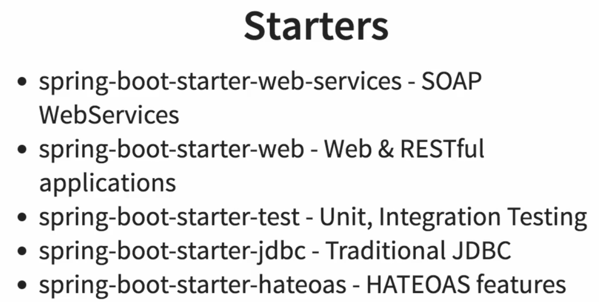
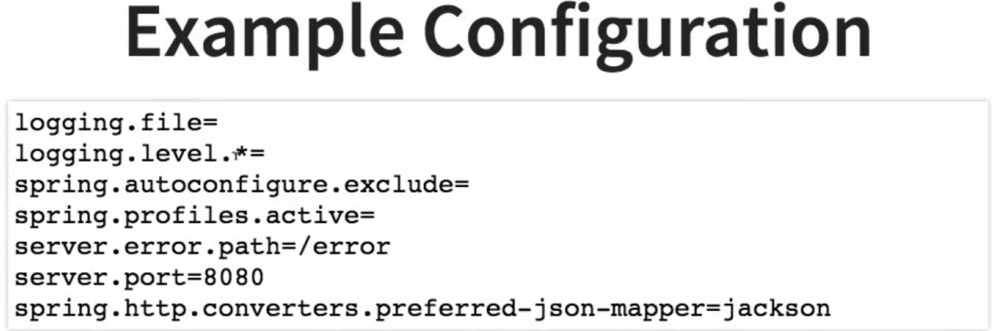
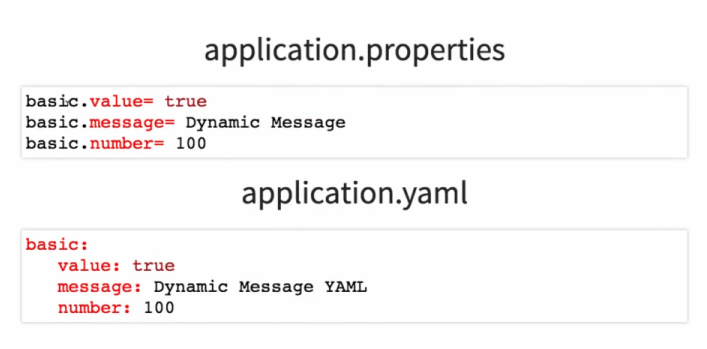

### 1. Why Spring Boot?
- Spring based applications have a lot of configuration.
- When we use Spring MVC, we need to configure ComponentScan, DispatcherServlet, a view resolver, web jars, and more.
- Spring Boot is a project that is built on the top of the Spring framework. It provides a simpler and faster way to set up, configure, and run both simple and web-based applications.
- World is moving towards microservices and cloud-native applications. Spring Boot is the best choice for building microservices. 
****
### 2. What are Spring Boot goals?
- Quick start to Spring.
- Provide opinionated 'starter' dependencies to simplify build configuration.
- Non functional features like monitoring, error handling, embedded servers, security, metrics, health checks, and externalized configuration.
- Absolutely no code generation and no requirement for XML configuration.

****
### 3. What are Spring Boot Features?
- Auto Configuration (automatically configures your Spring application based on the JAR dependencies you added in the project)
- Spring Boot Starter Projects (provide quick setup for new projects like web, data, security, etc.)
- Spring Boot CLI (Command Line Interface)
- Spring Boot Actuator (monitoring, metrics, health checks, etc.)
- Embedded Server (Tomcat, Jetty, Undertow)

****
### 4. How to use Spring Boot?
- Add Spring Boot Starter Projects
- Add Spring Boot Actuator
- Add Spring Boot CLI
- Add Embedded Server

****
### 5. What is Spring Boot?
- Spring Boot is an open-source framework that provides a simpler and faster way to set up, configure, and run both simple and web-based applications.
- It provides a set of conventions and defaults to speed up the setup and development of Spring-based applications, making it easier to create stand-alone, production-grade Spring applications with minimal configuration.

****

### 6. Why Spring Boot?

Spring Boot offers several advantages that make it a preferred choice for developers and organizations:

1. **Simplified Configuration**:
   - **Convention over Configuration**: Spring Boot follows a convention-over-configuration approach, reducing the need for boilerplate code and complex XML configurations.
   - **Auto-Configuration**: Automatically configures your Spring application based on the dependencies you have added. For example, if you include Spring Data JPA, Spring Boot will automatically set up a DataSource and an EntityManager.

2. **Standalone Applications**:
   - **Embedded Servers**: Spring Boot applications can run independently without needing an external application server. It embeds servers like Tomcat, Jetty, or Undertow directly within the application.
   - **Fat JARs**: Spring Boot applications are packaged as executable JARs (or WARs) that contain everything needed to run the application, simplifying deployment.

3. **Production-Ready Features**:
   - **Monitoring and Management**: Spring Boot provides built-in support for application monitoring and management through endpoints available via Actuator, which helps in monitoring the health, metrics, and other runtime details of the application.
   - **Externalized Configuration**: Supports external configuration via properties or YAML files, environment variables, and command-line arguments, making it easy to manage different configurations for various environments.

4. **Microservices**:
   - **Microservices Architecture**: Spring Boot is well-suited for building microservices, providing tools and frameworks like Spring Cloud to simplify the development of distributed systems.

5. **Developer Productivity**:
   - **Spring Initializr**: A web-based tool that allows you to quickly generate a Spring Boot project with the necessary dependencies.
   - **Spring Boot DevTools**: Enhances the development experience with features like automatic restarts, live reload, and configurations for a smoother development workflow.
   - **Test Support**: Simplifies testing by providing various testing utilities and annotations.

6. **Community and Ecosystem**:
   - **Active Community**: Spring Boot benefits from the large, active Spring community, which contributes to extensive documentation, tutorials, and support.
   - **Rich Ecosystem**: Integrates seamlessly with other Spring projects like Spring Data, Spring Security, Spring Batch, and Spring Cloud, providing a comprehensive ecosystem for various application needs.

### Example

A simple Spring Boot application can be created with minimal code. Here’s an example:

1. **Project Structure**:
   - `src/main/java/com/example/demo/DemoApplication.java`
   - `src/main/resources/application.properties`

2. **Main Application Class**:

```java
package com.example.demo;

import org.springframework.boot.SpringApplication;
import org.springframework.boot.autoconfigure.SpringBootApplication;

@SpringBootApplication
public class DemoApplication {
    public static void main(String[] args) {
        SpringApplication.run(DemoApplication.class, args);
    }
}
```

3. **Controller Example**:

```java
package com.example.demo.controller;

import org.springframework.web.bind.annotation.GetMapping;
import org.springframework.web.bind.annotation.RestController;

@RestController
public class HelloController {

    @GetMapping("/hello")
    public String sayHello() {
        return "Hello, Spring Boot!";
    }
}
```

4. **application.properties**:

```properties
server.port=8081
```

### Summary

- **What is Spring Boot?**: An extension of the Spring Framework that simplifies the creation of stand-alone, production-grade Spring applications with minimal configuration.
- **Why Spring Boot?**:
  - Simplified configuration with convention over configuration and auto-configuration.
  - Ability to create standalone applications with embedded servers.
  - Production-ready features such as monitoring, management, and externalized configuration.
  - Support for microservices architecture.
  - Enhanced developer productivity with tools like Spring Initializr and DevTools.
  - Strong community support and a rich ecosystem of Spring projects.

****

### 7. Spring vs Spring Boot?

### Spring -

 
The problem Spring solves is - 
- write loose coupled code.
- easy to test, as dependencies can be easily mocked.
- Good intergration with other frameworks like Spring Data, Spring Security, Spring Batch, Spring Cloud, etc.

### Spring MVC -


The problem Spring MVC solves is -
- Easy way of developing web applications.
- With simple concepts like DispatcherServlet, ModelAndView, ViewResolver, it makes it easy to develop web applications.

### Spring Boot -


> - #### Spring Boot eliminates manual configuration and auto configures the application based on the dependencies you have added.


****

### 8. What is the importance of @SpringBootApplication?


**@SpringBootApplication combines three essential annotations (@Configuration, @EnableAutoConfiguration, and @ComponentScan), simplifying configuration.**

#### Components of @SpringBootApplication

1. **@Configuration**:
   - **Purpose**: Indicates that the class can be used by the Spring IoC container as a source of bean definitions.
   - **Example**: This allows you to define beans using `@Bean` methods inside the annotated class.

2. **@EnableAutoConfiguration**:
   - **Purpose**: Tells Spring Boot to start adding beans based on classpath settings, other beans, and various property settings.
   - **Example**: Automatically configures your Spring application based on the dependencies present on the classpath (e.g., if `spring-boot-starter-web` is present, it will configure a web server).

3. **@ComponentScan**:
   - **Purpose**: Enables component scanning, allowing Spring to find and register beans (e.g., `@Component`, `@Service`, `@Repository`, `@Controller`) within the specified package.
   - **Example**: Automatically detects Spring components within the package where your application class is located and its sub-packages.

#### Benefits of @SpringBootApplication

1. **Convenience**:
   - **Simplified Configuration**: Instead of using multiple annotations like `@Configuration`, `@EnableAutoConfiguration`, and `@ComponentScan`, you only need to use `@SpringBootApplication`.
   - **Example**:
     ```java
     @SpringBootApplication
     public class MyApplication {
         public static void main(String[] args) {
             SpringApplication.run(MyApplication.class, args);
         }
     }
     ```

2. **Auto-Configuration**:
   - **Automatic Setup**: Automatically configures your application based on the dependencies you have included, reducing the need for explicit configuration.
   - **Example**: If you include `spring-boot-starter-data-jpa`, Spring Boot will automatically configure JPA-related beans and settings.

3. **Component Scanning**:
   - **Automatic Bean Detection**: Scans the package of the annotated class and its sub-packages for Spring components, ensuring that your beans are detected and registered without extra configuration.
   - **Example**:
     ```java
     @Component
     public class MyComponent {
         // Bean definition
     }
     ```

4. **Application Context Management**:
   - **Integrated Context**: Manages the application context setup and lifecycle, allowing you to focus on developing your application logic.
   - **Example**: The context is automatically created and managed when you run your application using `SpringApplication.run()`.

#### Example Usage

```java
@SpringBootApplication
public class MyApplication {
    public static void main(String[] args) {
        SpringApplication.run(MyApplication.class, args);
    }
}

@RestController
public class MyController {
    @GetMapping("/hello")
    public String sayHello() {
        return "Hello, World!";
    }
}
```

In this example:
- The `@SpringBootApplication` annotation sets up the application context, component scanning, and auto-configuration.
- The `MyController` class is automatically detected and registered as a bean due to component scanning.
- When the application is run, the embedded server is automatically configured, and the REST endpoint `/hello` is made available.

****

### 9. What is Auto-Configuration?


Auto-configuration is an annotation that tells Spring Boot to automatically configure your application based on the dependencies you have added.

we have spring-boot-autoconfigure jar in our classpath which 

****


### 10. Finding Information About Auto Configuration Using Spring Boot Autoconfigure JAR

1. **Explore the `spring-boot-autoconfigure` JAR**:
   - Open the JAR in your IDE or archive tool.
   - Navigate to `META-INF/spring.factories`.

2. **Check `META-INF/spring.factories`**:
   - This file lists all auto-configuration classes that Spring Boot can apply.

   **Example**:
   ```properties
   org.springframework.boot.autoconfigure.EnableAutoConfiguration=\
   org.springframework.boot.autoconfigure.admin.SpringApplicationAdminJmxAutoConfiguration,\
   org.springframework.boot.autoconfigure.aop.AopAutoConfiguration,\
   org.springframework.boot.autoconfigure.amqp.RabbitAutoConfiguration,\
   ...
   ```

3. **Review Auto-Configuration Classes**:
   - These classes typically reside in the `org.springframework.boot.autoconfigure` package.
   - Example class: `DataSourceAutoConfiguration`.

4. **Enable Debugging**:
   - Add `debug=true` to your `application.properties` to log detailed auto-configuration information.
   
   **Example**:
   ```properties
   debug=true
   ```

This will provide insights into which auto-configurations are being applied or skipped based on the present classpath and configurations.

****

### 11. What is an embedded server? Why is it important?


**If I have a server where Java is already installed, and I have a web application that requires Tomcat, the first thing I would need to do is install Tomcat on the server. This involves installing Java first, then Tomcat, and configuring the server beforehand.**

**But even before installing the application, I would need to pre-configure the server with all the necessary settings, which involves several steps.**

**Instead of that, we can use an embedded server. The concept of an embedded server means that your server is integrated as part of your application, so the server becomes a direct component of your JAR file. For example, Tomcat server is embedded directly into your JAR.**

**So, if I want to run this application from the JAR file, I don't need a separate Tomcat server because the Tomcat server is already included in our JAR. All I need is Java installed on that machine.**

**Therefore, for development or deployment — for instance, if I want to deploy this application to a QA environment and we are starting from scratch — all I need to do is install Java there. That's the only requirement. Then, I can simply run this JAR file because the Tomcat server is already packaged with it.**

**The concept of an embedded server greatly simplifies deploying applications into various deployment environments. With cloud computing, where creating and removing environments is common, embedded servers make it easy to set up new environments quickly and remove them as needed.**

> Embedded servers eliminate the need to pre-install a server on each deployment environment.

> The default embedded server for Spring Boot is **Tomcat**.


---

### 12. What are Starter Projects and give example of important starter projects?
Spring boot starters has all the dependencies that you need to get started with spring boot.

Starter projects in Spring Boot are pre-configured templates that simplify the setup of applications by providing essential dependencies and configurations. Here are some key examples:

- **Spring Boot Starter Web**: For building web applications with Spring MVC.
- **Spring Boot Starter Data JPA**: Simplifies database access with Spring Data JPA.
- **Spring Boot Starter Security**: Includes security configurations for securing applications.
- **Spring Boot Starter Test**: Provides testing dependencies for unit and integration testing.
- **Spring Boot Starter Actuator**: Adds production-ready features for monitoring and managing applications.
- **Spring Boot Starter Thymeleaf**: Integrates Thymeleaf for server-side HTML rendering.
- **Spring Boot Starter for Apache Kafka**: Facilitates integration with Apache Kafka for real-time data streaming.

By using these starters, developers can quickly set up projects, adhere to best practices, and focus more on application logic rather than configuration details.





---

### 13. What is Starter Parent and how does Spring Boot enforce common dependency management for all its Starter projects?
**Starter Parent** in Spring Boot is a special kind of project template that simplifies the management of dependencies across multiple Spring Boot starter projects. Here's how it works and what it defines:

### What is Starter Parent?

- **Definition**: Starter Parent is a Maven or Gradle project configuration that serves as a parent or base for other Spring Boot projects.
- **Purpose**: It standardizes dependency versions and configurations across multiple Spring Boot starter projects, ensuring consistency and compatibility.

### How Spring Boot Enforces Dependency Management:


So if I'm using a specific version of Spring, then what version of Hibernate Validator should I use? What version of Jackson should I use? What version of Spring Security should I use?

That's always a confusing thing because you don't know when there would be conflicts. So you have to do some kind of trial and error to figure out what are the compatible versions of different frameworks.

That's what Spring Boot eliminates by specifying all the dependency versions in `spring-boot-dependencies`. It says, "Okay, you as a programmer, you don't worry about the versions, you just say what you need. I know what are all the compatible versions."

So in `spring-boot-dependencies`, all the versions for more than 250 jars are defined, and all the versioning is taken care of there. I don't need to worry about which version to use.

All that I need to tell Spring Boot is I want to use Jackson. That's it. I don't need to tell it the version to use; I just need to tell it I want to use Spring Security based on the version of Spring I'm using. It would automatically configure the right version of Spring Security for me.

All these features Spring Boot achieves through its Starter Parent mechanism.

- **Automatic Inheritance**: When a new Spring Boot project is created using a starter, it inherits from Starter Parent. This inheritance automatically applies the defined dependencies and configurations.
- **Version Alignment**: Spring Boot ensures that all starter projects use compatible versions of dependencies, reducing compatibility issues.
- **Simplified Maintenance**: By centralizing dependency management in Starter Parent, Spring Boot simplifies maintenance and upgrades across its ecosystem. Developers don't need to manually manage versions for each dependency.

In essence, Starter Parent acts as a standardized foundation for Spring Boot projects, providing consistent dependency management and configurations, which promotes easier development, maintenance, and compatibility across different Spring Boot applications.

---

### 14. What is Spring Initializr?

Spring Initializr is a web-based tool provided by the Spring team to bootstrap and generate the structure of new Spring Boot projects quickly and easily. Here’s what you need to know about it:

### Key Features of Spring Initializr:

1. **Project Generation**: It allows developers to create new Spring Boot projects with a predefined project structure and configuration. Developers can specify project metadata such as group, artifact, and dependencies.

2. **Dependency Management**: Developers can choose dependencies (called starters) like web, data JPA, security, etc., which are essential for their project. Spring Initializr ensures these dependencies are included with compatible versions.

3. **Customization**: Provides options to customize the project metadata, such as the Java version, Spring Boot version, packaging format (JAR or WAR), and the build system (Maven or Gradle).

4. **Generated Project Structure**: Generates a ready-to-use project structure with the chosen dependencies, configuration files, build scripts (pom.xml or build.gradle), and an initial application class to get started quickly.

5. **Integration**: Integrates seamlessly with popular IDEs like IntelliJ IDEA, Eclipse, and Visual Studio Code, allowing developers to import the generated project directly into their preferred development environment.

6. **Continuous Updates**: Spring Initializr is regularly updated with the latest versions of Spring Boot and its dependencies, ensuring developers have access to the latest features and improvements.

### How to Use Spring Initializr:

- **Access**: Spring Initializr is accessible through a web interface at [start.spring.io](https://start.spring.io/).
- **Selection**: Choose the project metadata (like Group, Artifact, etc.), dependencies (starters), and customization options.
- **Generation**: Generate the project structure and download it as a zip file.
- **Import**: Import the generated project into an IDE or build it using Maven or Gradle commands.

### Benefits of Spring Initializr:

- **Saves Time**: Eliminates the need to set up the initial project structure manually, saving significant setup time.
- **Standardization**: Ensures consistency in project setup and dependency management across different projects and teams.
- **Ease of Use**: User-friendly interface with straightforward options for configuring and generating projects.

In essence, Spring Initializr simplifies the process of starting new Spring Boot projects by providing a convenient way to set up projects with the right dependencies and configurations, allowing developers to focus more on application development rather than setup and boilerplate code.

---

### 15. What is application.properties and name some of the important things that can customized in application.properties?




`application.properties` is a configuration file used in Spring Boot applications to define various settings and properties. This file allows you to customize the behavior of your Spring Boot application by setting key-value pairs for different configurations.

### Important Customizations in `application.properties`:

1. **Server Configuration**:
   - **Server Port**: Change the default server port.
     ```properties
     server.port=9090
     ```

2. **Logging Configuration**:
   - **File Location**: Set the location and name of the logging file.
     ```properties
     logging.file.name=/path/to/your/logfile.log
     ```
   - **Logging Levels**: Set the logging level for different packages.
     ```properties
     logging.level.org.springframework=DEBUG
     ```

3. **Profiles**:
   - **Active Profiles**: Define which profiles are active.
     ```properties
     spring.profiles.active=dev
     ```

4. **Database Configuration**:
   - **Datasource URL**: Set the URL of the database.
     ```properties
     spring.datasource.url=jdbc:mysql://localhost:3306/mydb
     ```
   - **Datasource Username and Password**: Set the database username and password.
     ```properties
     spring.datasource.username=root
     spring.datasource.password=password
     ```

5. **Error Handling**:
   - **Error Path**: Change the default error path.
     ```properties
     server.error.path=/custom-error
     ```

6. **Security Configuration**:
   - **User Credentials**: Set default security credentials.
     ```properties
     spring.security.user.name=admin
     spring.security.user.password=admin123
     ```

7. **View Resolver Configuration**:
   - **Prefix and Suffix**: Set the prefix and suffix for view templates.
     ```properties
     spring.mvc.view.prefix=/WEB-INF/views/
     spring.mvc.view.suffix=.jsp
     ```

8. **HTTP Message Converters**:
   - **JSON Mapper**: Set the preferred JSON mapper.
     ```properties
     spring.mvc.converters.preferred-json-mapper=gson
     ```

9. **File Upload Settings**:
   - **Max File Size**: Set the maximum file size for uploads.
     ```properties
     spring.servlet.multipart.max-file-size=2MB
     spring.servlet.multipart.max-request-size=2MB
     ```

10. **Thymeleaf Configuration**:
    - **Cache**: Enable or disable template caching.
      ```properties
      spring.thymeleaf.cache=false
      ```

These are just a few examples of the many configurations that can be customized using `application.properties` in a Spring Boot application. This file provides a centralized way to manage and tweak application settings without changing the code.

Summary - 
- It is like a property file.
- We can toggle log level values in application.properties.
- how we can to create serialisation
- can set spring security username/password

---

### 16. How do you externalize configuration using Spring Boot?


### `application.properties` and `application.yml`

In Spring Boot, `application.properties` and `application.yml` are used to externalize configuration. This allows you to manage and modify configuration settings separately from your application code.

### What is `application.properties`?

`application.properties` is a file where configuration settings are defined in a key-value format.

**Example**:
```properties
logging.level.org.springframework=DEBUG
server.port=9090
```

### What is `application.yml`?

`application.yml` is an alternative configuration file that uses YAML syntax, which stands for "YAML Ain't Markup Language." YAML is more readable and organizes configurations hierarchically.

**Example**:
```yaml
logging:
  level:
    org:
      springframework: DEBUG

server:
  port: 9090
```

### Key Customizations in `application.properties` or `application.yml`:

1. **Logging Configuration**:
   - **Logging Level**:
     ```properties
     logging.level.org.springframework=DEBUG
     ```
     ```yaml
     logging:
       level:
         org:
           springframework: DEBUG
     ```

2. **Server Configuration**:
   - **Server Port**:
     ```properties
     server.port=9090
     ```
     ```yaml
     server:
       port: 9090
     ```

These files provide a centralized way to manage application settings, making it easier to adjust configurations without modifying the code itself.

---

### 17. How can you add custom application properties using Spring Boot?


If you want to define custom properties in `application.properties` or `application.yml`, you can do this in application.properties or application.yml - 



---

### 18. What is @ConfigurationProperties?

`@ConfigurationProperties` is an annotation used in Spring Boot to bind external configuration properties (from `application.properties`, `application.yml`, environment variables, etc.) to a Java class. It allows you to group related properties together in a type-safe manner.

**Key Features**:
- **Prefix-Based Binding**: You specify a prefix, and all properties that start with that prefix are mapped to the fields in the class.
- **Type Safety**: Properties are bound to specific types, providing compile-time checking.
- **Easier Management**: Grouping related properties into a class makes it easier to manage and understand configuration settings.

**Example**:
```java
import org.springframework.boot.context.properties.ConfigurationProperties;
import org.springframework.stereotype.Component;

@Component
@ConfigurationProperties(prefix = "app")
public class AppProperties {
    private String name;
    private String description;

    // Getters and Setters

    public String getName() {
        return name;
    }

    public void setName(String name) {
        this.name = name;
    }

    public String getDescription() {
        return description;
    }

    public void setDescription(String description) {
        this.description = description;
    }
}
```

This class will automatically have its fields populated with the values from properties that start with `app.` in your `application.properties` or `application.yml`.

---

### 19. What is a Profile?


> **Note**: We can even customise java beans with profiles.


In Spring, a profile is a way to segregate parts of your application configuration and make them available only in certain environments. This is useful for creating different configurations for development, testing, production, etc., without changing the main codebase.

---

### 20. How do you define beans for a specific profile?

You can define beans for a specific profile using the `@Profile` annotation. This annotation indicates that a particular bean should only be created and managed by the Spring container if the specified profile is active.

**Example**:

```java
import org.springframework.context.annotation.Bean;
import org.springframework.context.annotation.Configuration;
import org.springframework.context.annotation.Profile;

@Configuration
public class AppConfig {

    @Bean
    @Profile("dev")
    public DataSource devDataSource() {
        // return development DataSource
    }

    @Bean
    @Profile("prod")
    public DataSource prodDataSource() {
        // return production DataSource
    }
}
```

In this example, the `devDataSource` bean will only be created if the "dev" profile is active, and the `prodDataSource` bean will only be created if the "prod" profile is active.

---

### 21. How do you create application configuration for a specific profile?

You can create application configurations for specific profiles by using profile-specific configuration files. These files follow the naming convention `application-{profile}.properties` or `application-{profile}.yml`.

**Example**:

1. **`application.properties` (common configuration)**:
   ```properties
   app.name=MyApp
   ```

2. **`application-dev.properties` (development-specific configuration)**:
   ```properties
   app.environment=development
   server.port=8081
   ```

3. **`application-prod.properties` (production-specific configuration)**:
   ```properties
   app.environment=production
   server.port=8080
   ```

### Activating a Profile

You can activate a profile in several ways:

1. **Via Command Line**:
   - Use the `--spring.profiles.active` parameter when starting the application.
   ```bash
   java -jar myapp.jar --spring.profiles.active=dev
   ```

2. **In `application.properties` or `application.yml`**:
   - Add the `spring.profiles.active` property.
   ```properties
   spring.profiles.active=dev
   ```
   ```yaml
   spring:
     profiles:
       active: dev
   ```

3. **Environment Variable**:
   - Set the `SPRING_PROFILES_ACTIVE` environment variable.
   ```bash
   export SPRING_PROFILES_ACTIVE=dev
   ```

4. **Programmatically**:
   - You can activate profiles programmatically using the `SpringApplication` class.
   ```java
   import org.springframework.boot.SpringApplication;
   import org.springframework.boot.autoconfigure.SpringBootApplication;

   @SpringBootApplication
   public class MyApp {

       public static void main(String[] args) {
           SpringApplication app = new SpringApplication(MyApp.class);
           app.setAdditionalProfiles("dev");
           app.run(args);
       }
   }
   ```

### Summary

- **Profile**: A way to segregate parts of the application configuration for different environments (dev, test, prod, etc.).
- **Defining Beans for a Profile**: Use the `@Profile` annotation on beans that should only be available in specific profiles.
- **Profile-Specific Configuration Files**: Use `application-{profile}.properties` or `application-{profile}.yml` to define environment-specific settings.
- **Activating a Profile**: Profiles can be activated via command line, configuration files.

---

### 22. What is Spring Boot Actuator?


So spring boot Actuator is basically an application which you can use to monitor your application with spring boot.

Spring Boot Actuator provides various features like health checks, metrics, and more.
All that you need to do is to add a simple dependency.


Application Metrics -> can get how many times user failed login / successful login

Spring Boot Actuator is a sub-project of Spring Boot that provides production-ready features to help you monitor and manage your application. Actuator includes a number of built-in endpoints that provide various metrics, information, and control capabilities.

---

### 23. How to Monitor Web Services Using Spring Boot Actuator

To monitor web services using Spring Boot Actuator, follow these steps:

1. **Add the Actuator Dependency**:
   Add the Spring Boot Actuator dependency to your `pom.xml` (Maven) or `build.gradle` (Gradle) file.

   **Maven**:
   ```xml
   <dependency>
       <groupId>org.springframework.boot</groupId>
       <artifactId>spring-boot-starter-actuator</artifactId>
   </dependency>
   ```

   **Gradle**:
   ```groovy
   implementation 'org.springframework.boot:spring-boot-starter-actuator'
   ```

2. **Enable Actuator Endpoints**:
   By default, some actuator endpoints are disabled. You can enable them in your `application.properties` or `application.yml` file.

   ```properties
   management.endpoints.web.exposure.include=*
   ```

   ```yaml
   management:
     endpoints:
       web:
         exposure:
           include: "*"
   ```

3. **Access Actuator Endpoints**:
   Actuator provides several endpoints, such as `/actuator/health`, `/actuator/info`, and `/actuator/metrics`.

   **Example Endpoints**:
   - **Health Check**: `http://localhost:8080/actuator/health`
   - **Application Info**: `http://localhost:8080/actuator/info`
   - **Metrics**: `http://localhost:8080/actuator/metrics`

4. **Customizing Actuator Endpoints**:
   You can customize the actuator endpoints by configuring them in your `application.properties` or `application.yml`.

   **Example**:
   ```properties
   management.endpoint.health.show-details=always
   management.endpoint.info.enabled=true
   ```

   ```yaml
   management:
     endpoint:
       health:
         show-details: always
       info:
         enabled: true
   ```

### 24. How to Find More Information About Your Application Environment Using Spring Boot Actuator

Spring Boot Actuator provides endpoints that offer detailed information about the application's environment. Here are a few key endpoints:

1. **Environment Endpoint**: Provides details about the environment properties.
   ```http
   GET /actuator/env
   ```

2. **Configuration Properties Endpoint**: Displays the configuration properties of your application.
   ```http
   GET /actuator/configprops
   ```

3. **Beans Endpoint**: Lists all the beans in the application context.
   ```http
   GET /actuator/beans
   ```

4. **Mappings Endpoint**: Shows the request mappings in your application.
   ```http
   GET /actuator/mappings
   ```

5. **System Metrics**: Provides various metrics related to the system and JVM.
   ```http
   GET /actuator/metrics
   ```

### Example of Using Spring Boot Actuator

1. **Setup**:
   Add the necessary dependencies and enable actuator endpoints as described above.

2. **Accessing the Environment Information**:
   - **Environment Properties**:
     ```http
     GET /actuator/env
     ```
   - **Example Output**:
     ```json
     {
       "activeProfiles": [
         "dev"
       ],
       "propertySources": [
         {
           "name": "systemProperties",
           "properties": {
             "java.runtime.name": {
               "value": "Java(TM) SE Runtime Environment"
             },
             ...
           }
         },
         ...
       ]
     }
     ```

3. **Accessing Configuration Properties**:
   - **Configuration Properties**:
     ```http
     GET /actuator/configprops
     ```
   - **Example Output**:
     ```json
     {
       "contexts": {
         "application": {
           "beans": {
             "spring.datasource-org.springframework.boot.autoconfigure.jdbc.DataSourceProperties": {
               "prefix": "spring.datasource",
               "properties": {
                 "url": "jdbc:h2:mem:testdb",
                 "username": "sa",
                 "password": ""
               }
             },
             ...
           }
         }
       }
     }
     ```

By using Spring Boot Actuator, you can easily monitor your web services, gain insights into your application's environment, and manage your application effectively in a production setting.

---

### 25. What is a CommandLineRunner?


If you implement a CommandLineRunner and implement a bean in your application then you have to implement a `run` method.

Then what will happen is, at the application startup time, Spring Boot will call the `run` method of the CommandLineRunner bean.


In Spring Boot, a `CommandLineRunner` is an interface that allows you to run specific pieces of code when the Spring application starts. It's typically used to perform tasks such as database initialization, data loading, or any kind of task that needs to be executed once the application is up and running. Here's a brief overview:

1. **Interface Definition**: `CommandLineRunner` is defined in Spring Boot as follows:
   ```java
   @FunctionalInterface
   public interface CommandLineRunner {
       void run(String... args) throws Exception;
   }
   ```
   It contains a single method `run`, which takes an array of `String` arguments (`args`) and can throw an `Exception`.

2. **Usage**: To use `CommandLineRunner`, you implement this interface in a Spring Bean and override the `run` method. When the Spring context is fully loaded, Spring Boot automatically calls the `run` method of all beans that implement `CommandLineRunner`.

3. **Example**: Here’s a simple example of a `CommandLineRunner` implementation:

   ```java
   import org.springframework.boot.CommandLineRunner;
   import org.springframework.stereotype.Component;

   @Component
   public class MyCommandLineRunner implements CommandLineRunner {

       @Override
       public void run(String... args) throws Exception {
           // Your initialization or startup code here
           System.out.println("Application started with command-line arguments: ");
           for (String arg : args) {
               System.out.println(arg);
           }
       }
   }
   ```

   In this example, `MyCommandLineRunner` is annotated with `@Component`, so it's automatically picked up by Spring Boot. When the application starts, the `run` method will print out any command-line arguments passed to the application.

4. **Ordering**: If you have multiple `CommandLineRunner` beans, you can control the order in which they execute using the `@Order` annotation or by implementing the `Ordered` interface.

Overall, `CommandLineRunner` is useful for executing specific tasks at application startup in a Spring Boot application, providing a way to perform initialization tasks or to trigger certain actions when the application context is ready.