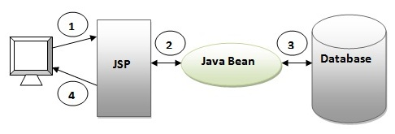
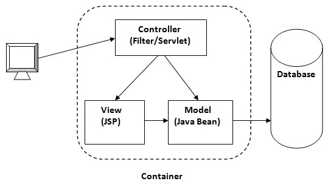

### 1. What is Model 1 architecture?

**Model 1 Architecture** is an early design pattern for developing web applications. In this architecture, JSP (JavaServer Pages) plays a central role, handling both the presentation and the business logic.



As you can see in the above figure, there is picture which show the flow of the Model1 architecture.

1. Browser sends request for the JSP page
2. JSP accesses Java Bean and invokes business logic
3. Java Bean connects to the database and get/save data
4. Response is sent to the browser which is generated by JSP

- **Flow**:
  - Client requests are directly sent to JSP pages.
  - JSP pages process the request, interact with the model (data), and generate a response.

- **Characteristics**:
  - Simple and straightforward for small applications.
  - JSP pages mix presentation logic (HTML) with business logic (Java code).
  - Limited separation of concerns.

- **Disadvantages**:
  - Difficult to maintain and scale.
  - Mixing of presentation and business logic can lead to spaghetti code.

****

### 2. What is Model 2 Architecture?


**Model 2 Architecture** is an advanced design pattern for developing web applications, commonly known as MVC (Model-View-Controller) architecture. It separates the application logic into three main components: Model, View, and Controller.

- **Flow**:
  - Client requests are sent to a controller.
  - The controller processes the request, interacts with the model, and forwards the response to a view.
  - The view renders the response to the client.

- **Components**:
  - **Model**: Represents the application's data and business logic.
  - **View**: Represents the presentation layer (typically JSP or other templating engines).
  - **Controller**: Handles user requests and controls the flow of the application.

- **Characteristics**:
  - Clear separation of concerns.
  - Easier to maintain and extend.
  - More scalable for larger applications.

****
### 3. What is Model 2 Front Controller Architecture?

**Model 2 Front Controller Architecture** is a refinement of the Model 2 (MVC) architecture where a single controller, known as the Front Controller, handles all incoming requests. This pattern further decouples the request handling logic from the business logic and view rendering.

- **Flow**:
  - Client requests are sent to a single front controller.
  - The front controller delegates the request to specific handlers or controllers.
  - These handlers interact with the model and forward the response to the appropriate view.

- **Components**:
  - **Front Controller**: A central controller that handles all incoming requests and routes them to appropriate handlers.
  - **Handlers/Controllers**: Specific controllers that handle individual requests and business logic.
  - **Model**: Represents the application's data and business logic.
  - **View**: Represents the presentation layer (typically JSP or other templating engines).

- **Characteristics**:
  - Centralized control of request handling.
  - Simplified configuration and management of application flow.
  - Enhanced security and preprocessing capabilities (e.g., authentication, logging).
  - Easier to implement common functionalities like authentication, logging, and exception handling.

****
### Can you show an example controller method in Spring MVC?

```java
@Controller
public class MyController {

    @RequestMapping("/hello")
    public String sayHello(Model model) {
        model.addAttribute("message", "Hello, World!");
        return "helloView";
    }
}
```
**Summary**: The above example demonstrates a simple controller method in Spring MVC that maps a `/hello` request to the `sayHello` method. The method adds a message to the model and returns a view name (`helloView`).

****
### Can you explain a simple flow in Spring MVC?


1. **Client Request**: A user sends an HTTP request to a URL mapped to a Spring MVC controller.
2. **DispatcherServlet**: The request is received by the `DispatcherServlet`, the front controller in Spring MVC.
3. **Handler Mapping**: The `DispatcherServlet` consults the `HandlerMapping` to determine the appropriate controller to handle the request.
4. **Controller**: The controller processes the request. In the example above, `MyController`'s `sayHello` method handles the request.
5. **Model**: The controller interacts with the model to retrieve or update data. It adds data to the model to be used in the view.
6. **View Name**: The controller returns the view name (e.g., `helloView`).
7. **ViewResolver**: The `ViewResolver` resolves the logical view name to a physical view (e.g., `helloView.jsp`).
8. **Render View**: The view (e.g., JSP, Thymeleaf) is rendered and returned to the client.

**Summary**: A Spring MVC request flow starts with a client request and goes through the `DispatcherServlet`, `HandlerMapping`, and controller. The controller interacts with the model, returns a view name, and the `ViewResolver` resolves it to a physical view which is then rendered and returned to the client.

****
### What is a ViewResolver?

A `ViewResolver` is a component in Spring MVC that resolves view names to actual view files. It maps the logical view name returned by the controller to a specific view implementation (e.g., JSP file, Thymeleaf template).

**Example**:
```java
@Bean
public InternalResourceViewResolver viewResolver() {
    InternalResourceViewResolver resolver = new InternalResourceViewResolver();
    resolver.setPrefix("/WEB-INF/views/");
    resolver.setSuffix(".jsp");
    return resolver;
}
```
**Summary**: A `ViewResolver` in Spring MVC maps logical view names to physical view files, enabling the separation of view names in controllers from the actual view files.

****
### What is a Model?

A `Model` in Spring MVC is an interface that provides a way to pass attributes to the view for rendering. It acts as a container for the data to be displayed in the view.

**Example**:
```java
@Controller
public class MyController {

    @RequestMapping("/hello")
    public String sayHello(Model model) {
        model.addAttribute("message", "Hello, World!");
        return "helloView";
    }
}
```
**Summary**: The `Model` in Spring MVC is used to pass data from the controller to the view. It allows adding attributes that will be available in the view for rendering.

****
### What is ModelAndView?

`ModelAndView` is a holder for both the model and the view in Spring MVC. It encapsulates the data (model) and the view name or view object in one object.

**Example**:
```java
@Controller
public class MyController {

    @RequestMapping("/greeting")
    public ModelAndView greeting() {
        ModelAndView modelAndView = new ModelAndView();
        modelAndView.setViewName("greetingView");
        modelAndView.addObject("message", "Hello, Spring MVC!");
        return modelAndView;
    }
}
```
**Summary**: `ModelAndView` in Spring MVC combines both the model data and the view name into one object, simplifying the return type from controllers when both model and view need to be specified.

****
### What is a RequestMapping?

`@RequestMapping` is an annotation used to map HTTP requests to handler methods of MVC and REST controllers. It can map requests based on URL, HTTP method, request parameters, headers, and media types.

**Example**:
```java
@Controller
@RequestMapping("/home")
public class HomeController {

    @RequestMapping(value = "/welcome", method = RequestMethod.GET)
    public String welcome(Model model) {
        model.addAttribute("message", "Welcome to Spring MVC!");
        return "welcomeView";
    }
}
```
**Summary**: `@RequestMapping` is an annotation in Spring MVC that maps HTTP requests to specific controller methods based on URL patterns, HTTP methods, and other parameters, allowing precise routing of requests.

****
## Summary of All Concepts with Examples

- **Controller Method**:
  - Handles HTTP requests and returns a view name or `ModelAndView`.
  - **Example**: `@RequestMapping("/hello") public String sayHello(Model model)`

- **Flow in Spring MVC**:
  - Client request → `DispatcherServlet` → `HandlerMapping` → Controller → Model → View name → `ViewResolver` → Render view → Response to client.
  - **Example**: `MyController`'s `sayHello` method.

- **ViewResolver**:
  - Maps logical view names to actual view files.
  - **Example**: `InternalResourceViewResolver` mapping `helloView` to `helloView.jsp`.

- **Model**:
  - Passes data from the controller to the view.
  - **Example**: `model.addAttribute("message", "Hello, World!")`

- **ModelAndView**:
  - Encapsulates both model data and view name.
  - **Example**: `ModelAndView modelAndView = new ModelAndView("greetingView"); modelAndView.addObject("message", "Hello, Spring MVC!");`

- **RequestMapping**:
  - Maps HTTP requests to controller methods.
  - **Example**: `@RequestMapping(value = "/welcome", method = RequestMethod.GET)`

****
### What is Dispatcher Servlet?

The `DispatcherServlet` is the central dispatcher for HTTP request handlers/controllers in a Spring MVC application. It is responsible for routing incoming web requests to appropriate controller methods, handling the lifecycle of a request, and returning the appropriate response.

****
### How do you set up Dispatcher Servlet?

In a traditional Spring MVC application, you set up the `DispatcherServlet` in the `web.xml` configuration file or via Java configuration.

**Using `web.xml`:**

```xml
<web-app>
    <servlet>
        <servlet-name>dispatcher</servlet-name>
        <servlet-class>org.springframework.web.servlet.DispatcherServlet</servlet-class>
        <init-param>
            <param-name>contextConfigLocation</param-name>
            <param-value>/WEB-INF/spring/dispatcher-config.xml</param-value>
        </init-param>
        <load-on-startup>1</load-on-startup>
    </servlet>
    
    <servlet-mapping>
        <servlet-name>dispatcher</servlet-name>
        <url-pattern>/</url-pattern>
    </servlet-mapping>
</web-app>
```

**Using Java Configuration:**

```java
import org.springframework.web.servlet.support.AbstractAnnotationConfigDispatcherServletInitializer;

public class MyWebAppInitializer extends AbstractAnnotationConfigDispatcherServletInitializer {

    @Override
    protected Class<?>[] getRootConfigClasses() {
        return new Class[] { RootConfig.class };
    }

    @Override
    protected Class<?>[] getServletConfigClasses() {
        return new Class[] { WebConfig.class };
    }

    @Override
    protected String[] getServletMappings() {
        return new String[] { "/" };
    }
}
```

In this setup, `RootConfig` and `WebConfig` are configuration classes annotated with `@Configuration`.

****
### Do we need to set up Dispatcher Servlet in Spring Boot?

No, in Spring Boot, you do not need to explicitly set up the `DispatcherServlet`. Spring Boot automatically configures the `DispatcherServlet` for you. By default, it is mapped to the root URL pattern (`/`), and Spring Boot will scan your classpath for `@Controller` and other related annotations.

**Spring Boot Application Class:**

```java
import org.springframework.boot.SpringApplication;
import org.springframework.boot.autoconfigure.SpringBootApplication;

@SpringBootApplication
public class MySpringBootApplication {
    public static void main(String[] args) {
        SpringApplication.run(MySpringBootApplication.class, args);
    }
}
```

In this setup, Spring Boot handles the `DispatcherServlet` setup internally, allowing you to focus on your application's logic without worrying about the boilerplate configuration.

### Summary

- **DispatcherServlet**: The core of Spring MVC that routes requests to appropriate handlers.
- **Traditional Setup**: Configured via `web.xml` or Java configuration.
- **Spring Boot**: Automatically configured, no explicit setup required.

****
### What is a Form Backing Object?

A **form backing object** in Spring MVC is a Java object that is used to capture form input data. It acts as a data holder for form fields, facilitating the transfer of form data between the view and the controller. The form backing object is typically a POJO (Plain Old Java Object) with properties that correspond to the form fields.

**Example**:
```java
public class User {
    private String name;
    private String email;
    // Getters and setters
}
```
****
### How is Validation Done Using Spring MVC?

Validation in Spring MVC is typically done using JSR-303/JSR-380 (Bean Validation API) annotations and a validator implementation. Spring provides support for validating form backing objects using these annotations and the `@Valid` or `@Validated` annotation in controller methods.

**Example**:

1. **Form Backing Object** with validation annotations:
    ```java
    import javax.validation.constraints.Email;
    import javax.validation.constraints.NotEmpty;

    public class User {
        @NotEmpty(message = "Name is required")
        private String name;

        @Email(message = "Email should be valid")
        @NotEmpty(message = "Email is required")
        private String email;

        // Getters and setters
    }
    ```

2. **Controller** method with `@Valid`:
    ```java
    import org.springframework.stereotype.Controller;
    import org.springframework.ui.Model;
    import org.springframework.validation.BindingResult;
    import org.springframework.web.bind.annotation.GetMapping;
    import org.springframework.web.bind.annotation.ModelAttribute;
    import org.springframework.web.bind.annotation.PostMapping;

    import javax.validation.Valid;

    @Controller
    public class UserController {

        @GetMapping("/userForm")
        public String showForm(Model model) {
            model.addAttribute("user", new User());
            return "userForm";
        }

        @PostMapping("/userForm")
        public String submitForm(@Valid @ModelAttribute("user") User user, BindingResult result) {
            if (result.hasErrors()) {
                return "userForm";
            }
            // Process the form submission
            return "success";
        }
    }
    ```
****
### What is BindingResult?

**BindingResult** is an interface provided by Spring that holds the results of the validation and binding of form backing objects. It contains information about validation errors and can be used to determine whether the form submission is valid.

**Example**:
```java
@PostMapping("/userForm")
public String submitForm(@Valid @ModelAttribute("user") User user, BindingResult result) {
    if (result.hasErrors()) {
        return "userForm";
    }
    // Process the form submission
    return "success";
}
```
****
### How Do You Map Validation Results to Your View?

Validation results are automatically mapped to the view using the `BindingResult` object. The view can then access the error messages through the Spring form tags.

**Example** (JSP):
```jsp
<form:form modelAttribute="user" method="post">
    <form:errors path="*" cssClass="error" />
    <div>
        <form:label path="name">Name:</form:label>
        <form:input path="name" />
        <form:errors path="name" cssClass="error" />
    </div>
    <div>
        <form:label path="email">Email:</form:label>
        <form:input path="email" />
        <form:errors path="email" cssClass="error" />
    </div>
    <input type="submit" value="Submit" />
</form:form>
```
****
### What are Spring Form Tags?

Spring form tags are a set of JSP tags provided by the Spring Framework to simplify the development of web forms. These tags bind form fields to form backing objects, making it easier to handle form data and validation errors.

**Common Spring Form Tags**:
- `<form:form>`: Represents the form element.
- `<form:input>`: Creates an input field.
- `<form:label>`: Creates a label for a field.
- `<form:errors>`: Displays validation errors.
- `<form:select>`: Creates a select (dropdown) field.
- `<form:option>`: Represents an option in a dropdown field.
- `<form:checkbox>`: Creates a checkbox input.
- `<form:radiobutton>`: Creates a radio button input.
- `<form:hidden>`: Creates a hidden input field.

**Example**:
```jsp
<%@ taglib uri="http://www.springframework.org/tags/form" prefix="form" %>
<html>
<body>
    <h2>User Form</h2>
    <form:form modelAttribute="user" method="post">
        <div>
            <form:label path="name">Name:</form:label>
            <form:input path="name" />
            <form:errors path="name" cssClass="error" />
        </div>
        <div>
            <form:label path="email">Email:</form:label>
            <form:input path="email" />
            <form:errors path="email" cssClass="error" />
        </div>
        <input type="submit" value="Submit" />
    </form:form>
</body>
</html>
```

**Summary**:

- **Form Backing Object**: A Java object that holds form data.
- **Validation in Spring MVC**: Done using JSR-303/JSR-380 annotations and the `@Valid` annotation in controllers.
- **BindingResult**: Holds validation and binding results.
- **Mapping Validation Results**: Done via the `BindingResult` object and Spring form tags.
- **Spring Form Tags**: JSP tags for simplifying form handling and validation in views.

****
### What is a Path Variable?

A **Path Variable** in Spring MVC is used to extract values from the URI of a web request. It allows you to capture dynamic values from the URI and use them in your controller methods.

**Example**:
```java
import org.springframework.stereotype.Controller;
import org.springframework.web.bind.annotation.PathVariable;
import org.springframework.web.bind.annotation.RequestMapping;
import org.springframework.web.bind.annotation.RequestMethod;
import org.springframework.web.bind.annotation.ResponseBody;

@Controller
public class MyController {

    @RequestMapping(value = "/user/{id}", method = RequestMethod.GET)
    @ResponseBody
    public String getUserById(@PathVariable("id") String userId) {
        return "User ID: " + userId;
    }
}
```
In this example, if a request is made to `/user/123`, the method `getUserById` will capture `123` as the `userId` parameter.

****
### What is a Model Attribute?

A **Model Attribute** in Spring MVC is used to bind a method parameter or a return value to a named model attribute, which can be accessed in the view. It is typically used to prepare data for rendering in the view.

**Example**:
```java
import org.springframework.stereotype.Controller;
import org.springframework.ui.Model;
import org.springframework.web.bind.annotation.ModelAttribute;
import org.springframework.web.bind.annotation.RequestMapping;
import org.springframework.web.bind.annotation.RequestMethod;

@Controller
public class MyController {

    @RequestMapping(value = "/form", method = RequestMethod.GET)
    public String showForm(Model model) {
        model.addAttribute("user", new User());
        return "userForm";
    }

    @RequestMapping(value = "/form", method = RequestMethod.POST)
    public String submitForm(@ModelAttribute User user) {
        // Process form submission
        return "result";
    }
}
```
In this example, the `User` object is added to the model and made available to the view (`userForm.jsp`). When the form is submitted, the `User` object is populated with the form data and processed in the `submitForm` method.

****
### What is a Session Attribute?

A **Session Attribute** in Spring MVC is used to store model attributes in the HTTP session, allowing them to persist across multiple requests. This is useful for maintaining state between requests.

**Example**:
```java
import org.springframework.stereotype.Controller;
import org.springframework.web.bind.annotation.ModelAttribute;
import org.springframework.web.bind.annotation.RequestMapping;
import org.springframework.web.bind.annotation.RequestMethod;
import org.springframework.web.bind.annotation.SessionAttributes;

@Controller
@SessionAttributes("user")
public class MyController {

    @RequestMapping(value = "/form", method = RequestMethod.GET)
    public String showForm(Model model) {
        model.addAttribute("user", new User());
        return "userForm";
    }

    @RequestMapping(value = "/form", method = RequestMethod.POST)
    public String submitForm(@ModelAttribute User user) {
        // Process form submission
        return "result";
    }

    @RequestMapping(value = "/clearSession", method = RequestMethod.GET)
    public String clearSession(SessionStatus status) {
        status.setComplete();
        return "sessionCleared";
    }
}
```
In this example, the `User` object is stored in the session and can be accessed across multiple requests. The `clearSession` method can be used to clear the session attributes.

**Summary**:

- **Path Variable**: Extracts values from the URI to use in controller methods.
- **Model Attribute**: Binds method parameters or return values to model attributes, making them accessible in views.
- **Session Attribute**: Stores model attributes in the HTTP session to maintain state across multiple requests.

****
### What is an Init Binder?

An **Init Binder** in Spring MVC is a mechanism that allows you to customize the way data is bound to the form backing objects. It is used to initialize `WebDataBinder`, which performs data binding from web request parameters to JavaBean objects. `@InitBinder` methods are used to register custom editors, formatters, and validators for specific form fields or types.

#### Key Uses of Init Binder:
- **Register Custom Property Editors**: To convert form field values to specific types.
- **Register Custom Formatters**: To format the input/output of date, number, or other complex types.
- **Add Validators**: To perform custom validation logic.

### Example of Init Binder

**Scenario**: You have a form that includes a date field and you want to use a specific date format.

#### Step 1: Define a form backing object
```java
public class User {
    private String name;
    private Date birthDate;

    // Getters and setters
}
```

#### Step 2: Define a controller with an `@InitBinder` method
```java
import org.springframework.stereotype.Controller;
import org.springframework.web.bind.WebDataBinder;
import org.springframework.web.bind.annotation.InitBinder;
import org.springframework.web.bind.annotation.ModelAttribute;
import org.springframework.web.bind.annotation.RequestMapping;
import org.springframework.web.bind.annotation.RequestMethod;
import org.springframework.web.bind.annotation.ResponseBody;

import java.text.SimpleDateFormat;
import java.util.Date;

@Controller
public class UserController {

    @InitBinder
    public void initBinder(WebDataBinder binder) {
        SimpleDateFormat dateFormat = new SimpleDateFormat("yyyy-MM-dd");
        dateFormat.setLenient(false);
        binder.registerCustomEditor(Date.class, new CustomDateEditor(dateFormat, false));
    }

    @RequestMapping(value = "/form", method = RequestMethod.GET)
    public String showForm(Model model) {
        model.addAttribute("user", new User());
        return "userForm";
    }

    @RequestMapping(value = "/form", method = RequestMethod.POST)
    @ResponseBody
    public String submitForm(@ModelAttribute User user) {
        // Process form submission
        return "Name: " + user.getName() + ", Birth Date: " + user.getBirthDate();
    }
}
```

#### Explanation:
1. **Form Backing Object**: `User` class with `name` and `birthDate` fields.
2. **Controller**:
   - The `@InitBinder` method `initBinder` is defined to customize the data binding process.
   - `WebDataBinder` is used to register a custom editor (`CustomDateEditor`) for `Date` class.
   - `CustomDateEditor` uses a `SimpleDateFormat` to parse and format dates in the "yyyy-MM-dd" format.
   - The `showForm` method adds a new `User` object to the model and returns the view name `userForm`.
   - The `submitForm` method processes the form submission and returns a response with the user's name and birth date.

#### Step 3: Define the form view (JSP example)
```jsp
<%@ taglib uri="http://www.springframework.org/tags/form" prefix="form" %>
<html>
<body>
    <h2>User Form</h2>
    <form:form modelAttribute="user" method="post">
        <div>
            <form:label path="name">Name:</form:label>
            <form:input path="name" />
        </div>
        <div>
            <form:label path="birthDate">Birth Date (yyyy-MM-dd):</form:label>
            <form:input path="birthDate" />
        </div>
        <input type="submit" value="Submit" />
    </form:form>
</body>
</html>
```

**Summary**:

- **Init Binder**: A method annotated with `@InitBinder` in a Spring MVC controller that customizes data binding.
- **Key Uses**:
  - Register custom property editors.
  - Register custom formatters.
  - Add validators.
- **Example**:
  - Custom date formatting using `CustomDateEditor`.
  - Binding form data to a `User` object with a `birthDate` field formatted as "yyyy-MM-dd".

This customization allows precise control over how form data is converted and validated before it is bound to the controller's method parameters.

****
To set a default date format in a Spring application, you typically use an `@InitBinder` method in your controller to register a custom date editor. This approach allows you to specify the date format that should be used for all date fields in your form backing objects.

Here is a detailed example:

### Step-by-Step Guide to Setting a Default Date Format

#### 1. Define the Form Backing Object

Create a simple Java class to represent your form data.

```java
public class User {
    private String name;
    private Date birthDate;

    // Getters and setters
    public String getName() {
        return name;
    }

    public void setName(String name) {
        this.name = name;
    }

    public Date getBirthDate() {
        return birthDate;
    }

    public void setBirthDate(Date birthDate) {
        this.birthDate = birthDate;
    }
}
```

#### 2. Define the Controller

Create a Spring MVC controller with an `@InitBinder` method to register the custom date editor.

```java
import org.springframework.beans.propertyeditors.CustomDateEditor;
import org.springframework.stereotype.Controller;
import org.springframework.ui.Model;
import org.springframework.web.bind.WebDataBinder;
import org.springframework.web.bind.annotation.InitBinder;
import org.springframework.web.bind.annotation.ModelAttribute;
import org.springframework.web.bind.annotation.RequestMapping;
import org.springframework.web.bind.annotation.RequestMethod;

import java.text.SimpleDateFormat;
import java.util.Date;

@Controller
public class UserController {

    @InitBinder
    public void initBinder(WebDataBinder binder) {
        SimpleDateFormat dateFormat = new SimpleDateFormat("yyyy-MM-dd");
        dateFormat.setLenient(false);
        binder.registerCustomEditor(Date.class, new CustomDateEditor(dateFormat, false));
    }

    @RequestMapping(value = "/form", method = RequestMethod.GET)
    public String showForm(Model model) {
        model.addAttribute("user", new User());
        return "userForm";
    }

    @RequestMapping(value = "/form", method = RequestMethod.POST)
    public String submitForm(@ModelAttribute User user, Model model) {
        // Process form submission
        model.addAttribute("user", user);
        return "result";
    }
}
```

#### 3. Define the View (JSP Example)

Create a JSP file for the form (e.g., `userForm.jsp`).

```jsp
<%@ taglib uri="http://www.springframework.org/tags/form" prefix="form" %>
<html>
<body>
    <h2>User Form</h2>
    <form:form modelAttribute="user" method="post">
        <div>
            <form:label path="name">Name:</form:label>
            <form:input path="name" />
        </div>
        <div>
            <form:label path="birthDate">Birth Date (yyyy-MM-dd):</form:label>
            <form:input path="birthDate" />
        </div>
        <input type="submit" value="Submit" />
    </form:form>
</body>
</html>
```

Create another JSP file to display the result (e.g., `result.jsp`).

```jsp
<html>
<body>
    <h2>Form Submitted</h2>
    <p>Name: ${user.name}</p>
    <p>Birth Date: ${user.birthDate}</p>
</body>
</html>
```

### Summary

1. **Form Backing Object**: Define a class (e.g., `User`) with a date field.
2. **Controller**: 
   - Use `@InitBinder` to register a `CustomDateEditor` with a specific date format.
   - Handle form display and submission.
3. **Views**: Create JSP files for the form and the result display.

This approach ensures that all date fields in your form backing objects use the specified date format ("yyyy-MM-dd" in this example), simplifying date handling and validation in your Spring application.

****

### Exception Handling in Spring MVC

Exception handling in Spring MVC can be done in various ways, from using traditional `try-catch` blocks to leveraging Spring's `@ExceptionHandler` and `@ControllerAdvice` annotations for a more centralized and sophisticated approach.

#### 1. Using `@ExceptionHandler` in Controllers

You can handle exceptions locally within a controller by using the `@ExceptionHandler` annotation. This annotation is used to define a method that will handle exceptions thrown by request handling methods in the same controller.

**Example**:
```java
import org.springframework.stereotype.Controller;
import org.springframework.web.bind.annotation.ExceptionHandler;
import org.springframework.web.bind.annotation.RequestMapping;
import org.springframework.web.bind.annotation.RequestMethod;
import org.springframework.web.bind.annotation.ResponseBody;

@Controller
public class MyController {

    @RequestMapping(value = "/test", method = RequestMethod.GET)
    public String test() {
        if (true) {
            throw new RuntimeException("Test exception");
        }
        return "test";
    }

    @ExceptionHandler(RuntimeException.class)
    @ResponseBody
    public String handleRuntimeException(RuntimeException ex) {
        return "Handled RuntimeException: " + ex.getMessage();
    }
}
```

#### 2. Using `@ControllerAdvice`

For a more global approach to exception handling, you can use `@ControllerAdvice`. This annotation allows you to define a class that will handle exceptions for all controllers or specific controllers.

**Example**:
```java
import org.springframework.web.bind.annotation.ControllerAdvice;
import org.springframework.web.bind.annotation.ExceptionHandler;
import org.springframework.web.bind.annotation.ResponseBody;
import org.springframework.web.servlet.ModelAndView;

@ControllerAdvice
public class GlobalExceptionHandler {

    @ExceptionHandler(RuntimeException.class)
    @ResponseBody
    public String handleRuntimeException(RuntimeException ex) {
        return "Handled by GlobalExceptionHandler: " + ex.getMessage();
    }

    @ExceptionHandler(Exception.class)
    public ModelAndView handleException(Exception ex) {
        ModelAndView mav = new ModelAndView("error");
        mav.addObject("message", ex.getMessage());
        return mav;
    }
}
```

In this example, `GlobalExceptionHandler` will handle `RuntimeException` and `Exception` globally for all controllers in the application.

### Summary

- **Local Exception Handling**:
  - Use `@ExceptionHandler` in a controller to handle exceptions thrown by methods in the same controller.

- **Global Exception Handling**:
  - Use `@ControllerAdvice` to create a global exception handler that applies to multiple controllers.
  - `@ExceptionHandler` methods within `@ControllerAdvice` can handle specific exceptions or a range of exceptions.

### Detailed Example with Controller Advice

#### Step 1: Create a Controller

```java
import org.springframework.stereotype.Controller;
import org.springframework.web.bind.annotation.GetMapping;
import org.springframework.web.bind.annotation.RequestMapping;
import org.springframework.web.bind.annotation.ResponseBody;

@Controller
@RequestMapping("/api")
public class MyApiController {

    @GetMapping("/test")
    @ResponseBody
    public String test() {
        if (true) {
            throw new RuntimeException("Test exception in API");
        }
        return "test";
    }
}
```

#### Step 2: Create a Global Exception Handler with `@ControllerAdvice`

```java
import org.springframework.web.bind.annotation.ControllerAdvice;
import org.springframework.web.bind.annotation.ExceptionHandler;
import org.springframework.web.bind.annotation.ResponseBody;
import org.springframework.web.servlet.ModelAndView;

@ControllerAdvice
public class GlobalExceptionHandler {

    @ExceptionHandler(RuntimeException.class)
    @ResponseBody
    public String handleRuntimeException(RuntimeException ex) {
        return "Handled by GlobalExceptionHandler: " + ex.getMessage();
    }

    @ExceptionHandler(Exception.class)
    public ModelAndView handleException(Exception ex) {
        ModelAndView mav = new ModelAndView("error");
        mav.addObject("message", ex.getMessage());
        return mav;
    }
}
```

In this setup:
- Any `RuntimeException` thrown by any controller will be handled by the `handleRuntimeException` method in `GlobalExceptionHandler`.
- Any general `Exception` will be handled by the `handleException` method, returning a view named `error` with an error message.

### Summary Points

- **Exception Handling in Controllers**:
  - `@ExceptionHandler` methods handle exceptions within the same controller.

- **Global Exception Handling with `@ControllerAdvice`**:
  - Centralized exception handling for all controllers.
  - Can handle specific exceptions and provide common handling logic across the application.
  - Simplifies maintenance by separating exception handling from business logic.

- **Use Cases**:
  - **Local Handling**: For specific exception handling needs within a single controller.
  - **Global Handling**: For a consistent and reusable exception handling strategy across the entire application.

****
### Why is Spring MVC so popular?
Spring MVC is popular for several reasons:

- **Simplicity**: Spring MVC provides a simple approach to creating web applications, with minimal configuration required.

- **Modularity**: It allows for a modular approach to design, which makes it easier to maintain and update the code.

- **Integration**: Spring MVC can be easily integrated with other popular Java frameworks like Hibernate, JPA, etc.

- **Testability**: It provides excellent support for testing, which makes it easier to ensure the quality of the application.

- **Community Support**: It has a large and active community, which means that help is readily available.

- **Versatility**: It can be used to develop a wide range of applications, from simple web sites to complex enterprise applications.

- **Documentation**: It has extensive and detailed documentation, which makes it easier to learn and use.


