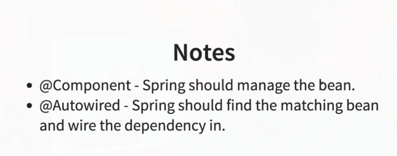
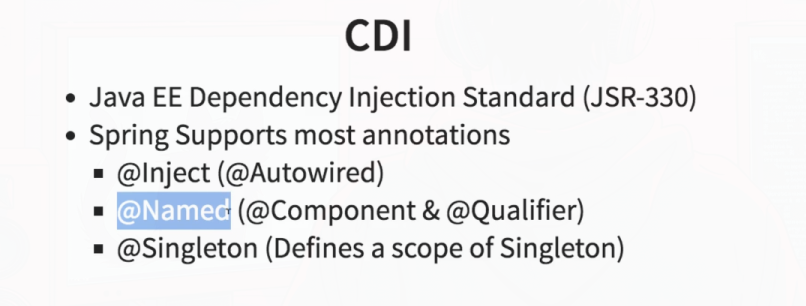
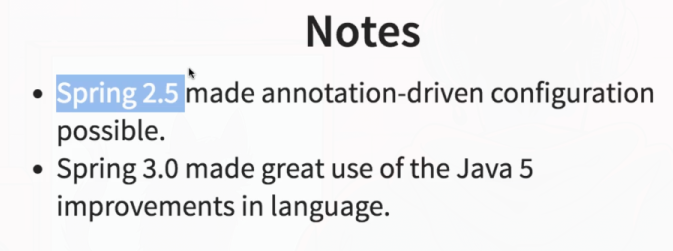
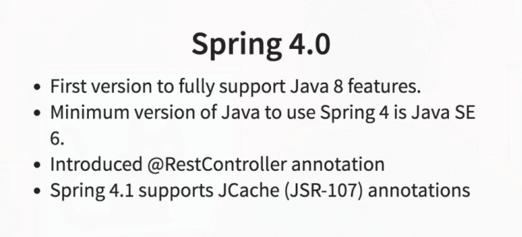
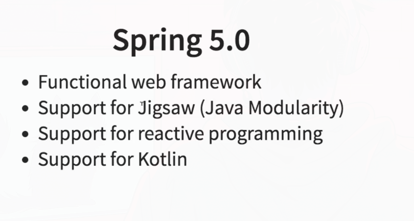
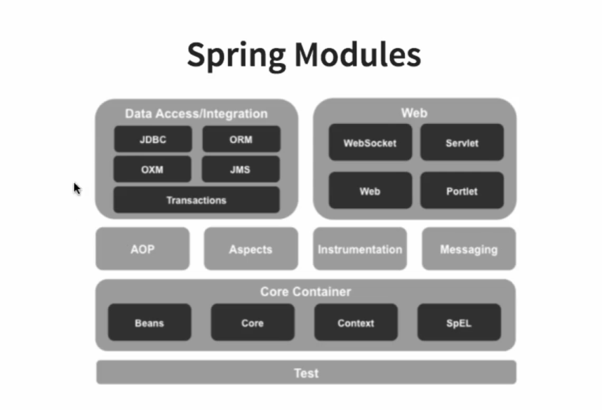

### 1. Loose Coupling vs Tight Coupling
**Tight Coupling**

Tight coupling refers to a situation where components in a system are highly dependent on each other. This means that a change in one component often necessitates changes in other components. Tight coupling can lead to systems that are hard to maintain, test, and extend because the interconnectedness means that altering one part of the system has wide-ranging effects.

**Example of Tight Coupling:**

Consider a class `A` that uses a class `B` directly:

```java
class B {
    public void doSomething() {
        System.out.println("Doing something in B");
    }\
}

class A {
    private B b = new B();

    public void execute() {
        b.doSomething();
    }
}
```

In this example, `A` is tightly coupled to `B`. If `B` changes (e.g., if the method `doSomething` is renamed or its parameters change), `A` also needs to be updated to accommodate these changes.

**Loose Coupling**

Loose coupling refers to a situation where components in a system have little or no knowledge of the definitions of other components. This makes the system more modular, easier to maintain, test, and extend because changes in one component are less likely to impact others.

**Example of Loose Coupling:**

Using interfaces or dependency injection can help achieve loose coupling. Here's how the above example can be refactored for loose coupling:

```java
interface Service {
    void doSomething();
}

class B implements Service {
    public void doSomething() {
        System.out.println("Doing something in B");
    }
}

class A {
    private Service service;

    public A(Service service) {
        this.service = service;
    }

    public void execute() {
        service.doSomething();
    }
}
```

In this example, `A` depends on an interface `Service` rather than a concrete class `B`. This way, `A` is not directly dependent on `B`. You can change the implementation of `B` or use a different implementation of `Service` without changing `A`:

```java
class AnotherService implements Service {
    public void doSomething() {
        System.out.println("Doing something in AnotherService");
    }
}

// Using the loosely coupled setup
Service service = new AnotherService();
A a = new A(service);
a.execute();  // Output: Doing something in AnotherService
```

**Benefits of Loose Coupling:**
- **Flexibility**: Components can be replaced or updated independently.
- **Maintainability**: Easier to understand, test, and modify.
- **Scalability**: New features or components can be added without significant refactoring.
- **Reusability**: Components can be reused in different contexts.

In summary, tight coupling creates a rigid system where components are heavily interdependent, whereas loose coupling promotes a more modular, flexible, and maintainable system.****
****

### 2. What is Dependency?

- A **dependency** in software engineering is a relationship where one component or module relies on another to function. 
- Dependencies can be between classes, functions, modules, services, or even entire applications. 
- Managing dependencies is crucial for building maintainable, scalable, and flexible software.

#### Example of Dependency

Consider two classes, `Car` and `Engine`. The `Car` class depends on the `Engine` class to function:

```java
public class Engine {
    public void start() {
        System.out.println("Engine started");
    }
}

public class Car {
    private Engine engine;

    public Car() {
        this.engine = new Engine(); // Car depends on Engine
    }

    public void drive() {
        engine.start();
        System.out.println("Car is driving");
    }
}

public class Main {
    public static void main(String[] args) {
        Car car = new Car();
        car.drive();
    }
}
```

In this example, `Car` is tightly coupled to `Engine`, meaning `Car` directly creates an instance of `Engine` and relies on it to function.

****
### 3. What is Dependency Injection?

- **Dependency Injection (DI)** is a design pattern used to achieve Inversion of Control (IoC) between classes and their dependencies. 
- Instead of a class creating its dependencies, they are provided externally. 
- This promotes loose coupling and makes the code more modular, testable, and maintainable.

#### Example of Dependency Injection

Using the same `Car` and `Engine` example, but applying dependency injection:

1. **Define the Engine Interface:**

```java
public interface Engine {
    void start();
}
```

2. **Implement the Engine Interface:**

```java
public class PetrolEngine implements Engine {
    @Override
    public void start() {
        System.out.println("Petrol engine started");
    }
}

public class DieselEngine implements Engine {
    @Override
    public void start() {
        System.out.println("Diesel engine started");
    }
}
```

3. **Modify the Car Class to Use Dependency Injection:**

```java
public class Car {
    private Engine engine;

    // Constructor Injection
    public Car(Engine engine) {
        this.engine = engine;
    }

    public void drive() {
        engine.start();
        System.out.println("Car is driving");
    }
}
```

4. **Inject Dependencies in the Main Method:**

```java
public class Main {
    public static void main(String[] args) {
        Engine petrolEngine = new PetrolEngine();
        Car carWithPetrolEngine = new Car(petrolEngine);
        carWithPetrolEngine.drive();

        Engine dieselEngine = new DieselEngine();
        Car carWithDieselEngine = new Car(dieselEngine);
        carWithDieselEngine.drive();
    }
}
```

### Benefits of Dependency Injection

1. **Loose Coupling:** By injecting dependencies, classes are less dependent on specific implementations, making the system more flexible.
2. **Testability:** Dependencies can be easily mocked or stubbed, making unit testing simpler and more effective.
3. **Maintainability:** Changes in dependencies require minimal changes in dependent classes.
4. **Reusability:** Components can be reused with different dependencies without modification.

### Types of Dependency Injection

1. **Constructor Injection:** Dependencies are provided through a class constructor.
    ```java
    public class Car {
        private Engine engine;

        public Car(Engine engine) {
            this.engine = engine;
        }
    }
    ```

2. **Setter Injection:** Dependencies are provided through setter methods.
    ```java
    public class Car {
        private Engine engine;

        public void setEngine(Engine engine) {
            this.engine = engine;
        }
    }
    ```

3. **Interface Injection:** Dependencies are provided through an interface. (Less common)
    ```java
    public interface Engine {
        void injectCar(Car car);
    }
    ```

### Conclusion

Dependency and Dependency Injection are core concepts in software design that promote modularity, flexibility, and testability. By externalizing the creation and management of dependencies, you can build more maintainable and adaptable software systems.
****

### Classes vs. Objects in Java

**Classes** and **objects** are fundamental concepts in object-oriented programming (OOP). Here’s a brief explanation along with examples to illustrate the difference between them.

### Classes

A **class** is a blueprint for creating objects. It defines the properties (attributes) and behaviors (methods) that the objects created from the class will have.

#### Example of a Class

```java
public class Car {
    // Properties (attributes)
    private String brand;
    private String model;
    private int year;

    // Constructor
    public Car(String brand, String model, int year) {
        this.brand = brand;
        this.model = model;
        this.year = year;
    }

    // Method (behavior)
    public void displayInfo() {
        System.out.println("Brand: " + brand + ", Model: " + model + ", Year: " + year);
    }
}
```

In this example:
- `Car` is a class with three properties: `brand`, `model`, and `year`.
- It has a constructor to initialize these properties.
- It has a method `displayInfo` to display the information of the car.

### Objects

An **object** is an instance of a class. It is a concrete entity based on the class blueprint and occupies memory.

#### Example of Objects

```java
public class Main {
    public static void main(String[] args) {
        // Creating objects from the Car class
        Car car1 = new Car("Toyota", "Corolla", 2020);
        Car car2 = new Car("Honda", "Civic", 2021);

        // Calling methods on the objects
        car1.displayInfo();
        car2.displayInfo();
    }
}
```

In this example:
- `car1` and `car2` are objects (instances) of the `Car` class.
- Each object has its own set of properties (`brand`, `model`, and `year`).
- The `displayInfo` method is called on each object to display its details.

### Key Differences

1. **Definition:**
   - **Class:** A template or blueprint for creating objects.
   - **Object:** An instance of a class.

2. **Memory Allocation:**
   - **Class:** Does not occupy memory until an object is created.
   - **Object:** Occupies memory when it is instantiated.

3. **Usage:**
   - **Class:** Defines the structure and behaviors that the objects will have.
   - **Object:** Represents individual instances that can have different states.

### Visual Representation

Consider a class as a blueprint for building a house:
- The **blueprint (class)** defines the structure, layout, and design of houses.
- **Houses (objects)** built from this blueprint can be different instances with unique colors, owners, and furniture but follow the same general design.

In summary:
- **Class:** Defines the properties and behaviors.
- **Object:** Is a specific instance of a class with actual values for the properties and capable of exhibiting the defined behaviors.
****

### 4. What is Inversion of Control (IOC)?
- Inversion of Control (IoC) is a design principle in software engineering where the control flow of a program is inverted. 
- Instead of the application controlling the flow, an external entity or framework takes over that control. 
- IoC is often used in conjunction with dependency injection to create more flexible, maintainable, and testable software.

### Key Concepts

1. **Traditional Control Flow:**
   - In a traditional setup, the application code directly controls the execution flow and manages dependencies. For example, creating objects, calling methods, etc.

2. **Inversion of Control:**
   - With IoC, the control is inverted. The framework or container takes over the responsibility of managing the flow of control and the lifecycle of objects. The application code provides configuration and business logic, while the framework handles the rest.

### How IoC Works

IoC can be implemented in various ways, such as using dependency injection, service locators, or event-driven programming. The most common approach is dependency injection.

### Dependency Injection and IoC

**Dependency Injection (DI)** is a technique used to achieve IoC by injecting dependencies into objects rather than the objects creating the dependencies themselves.

#### Example of IoC with Dependency Injection

Here's an example to illustrate IoC using dependency injection:

#### Without IoC

```java
public class Engine {
    public void start() {
        System.out.println("Engine started");
    }
}

public class Car {
    private Engine engine;

    public Car() {
        this.engine = new Engine(); // Car creates its own Engine
    }

    public void drive() {
        engine.start();
        System.out.println("Car is driving");
    }
}

public class Main {
    public static void main(String[] args) {
        Car car = new Car();
        car.drive();
    }
}
```

In this traditional setup, the `Car` class directly controls the creation of its `Engine` dependency.

#### With IoC (Dependency Injection)

```java
public interface Engine {
    void start();
}

public class PetrolEngine implements Engine {
    @Override
    public void start() {
        System.out.println("Petrol engine started");
    }
}

public class Car {
    private Engine engine;

    // Dependency is injected via constructor
    public Car(Engine engine) {
        this.engine = engine;
    }

    public void drive() {
        engine.start();
        System.out.println("Car is driving");
    }
}

public class Main {
    public static void main(String[] args) {
        Engine engine = new PetrolEngine(); // Engine dependency is created outside
        Car car = new Car(engine);          // Engine is injected into Car
        car.drive();
    }****
}
```

In this setup, the control of creating the `Engine` object is inverted. The `Car` class does not create its own `Engine` object but receives it from outside (injected through the constructor).

### Benefits of IoC

1. **Decoupling:**
   - Objects are less tightly coupled because they do not create their own dependencies. This makes the code more modular and flexible.

2. **Ease of Testing:**
   - Dependencies can be easily mocked or stubbed, facilitating unit testing.

3. **Reusability:**
   - Components can be reused more easily in different contexts because they are not tied to specific implementations of their dependencies.

4. **Maintainability:**
   - The application is easier to maintain and extend because changes to dependencies require minimal changes to the dependent classes.

### Summary

**Inversion of Control (IoC)** is a design principle that shifts the control of program execution and dependency management from the application code to an external framework or container. Dependency injection is a common method to achieve IoC, resulting in decoupled, testable, and maintainable code.

****
### 5. What is Bean in Spring?

In simple terms, a **bean** in the context of the Spring Framework is an object that is created, configured, and managed by the Spring container. Think of a bean as a component or building block of a Spring application that Spring takes care of for you.

### Key Points in Simple Terms:

1. **Object**: A bean is just a regular Java object.
2. **Managed by Spring**: Instead of you creating and managing this object directly in your code, Spring does it for you.
3. **Configuration**: You tell Spring how to create and configure this object either through XML files, Java annotations, or Java configuration classes.
4. **Dependency Injection**: Spring can inject dependencies into your beans, which means it can set up and connect the different parts of your application automatically.

### Simple Example:

Imagine you have a `Car` that needs an `Engine` to run. In Spring:

1. **Define the Beans**:
   - You tell Spring about the `Car` and `Engine` objects.

```java
public class Engine {
    public void start() {
        System.out.println("Engine started");
    }
}

public class Car {
    private Engine engine;

    public Car(Engine engine) {
        this.engine = engine;
    }

    public void drive() {
        engine.start();
        System.out.println("Car is driving");
    }
}
```

2. **Configuration with Annotations**:
   - Use `@Component` to tell Spring these are the objects it should manage.

```java
import org.springframework.stereotype.Component;

@Component
public class Engine {
    public void start() {
        System.out.println("Engine started");
    }
}

@Component
public class Car {
    private Engine engine;

    @Autowired
    public Car(Engine engine) {
        this.engine = engine;
    }

    public void drive() {
        engine.start();
        System.out.println("Car is driving");
    }
}
```

3. **Spring Takes Care of the Rest**:
   - You don’t have to create and wire up the `Car` and `Engine` objects manually. Spring does it for you.

```java
import org.springframework.context.ApplicationContext;
import org.springframework.context.annotation.AnnotationConfigApplicationContext;

public class Main {
    public static void main(String[] args) {
        ApplicationContext context = new AnnotationConfigApplicationContext(AppConfig.class);
        Car car = context.getBean(Car.class);
        car.drive();
    }
}
```

In this setup:
- Spring creates the `Engine` and `Car` objects.
- Spring injects the `Engine` into the `Car` automatically.

### Summary:

A **bean** is a Spring-managed object that Spring takes care of creating, configuring, and wiring together with other beans. This helps simplify your application code and manage dependencies more effectively.

****
### 6. What is Autowiring?

- **Autowiring** is a feature in Spring Framework that allows the automatic injection of dependencies into a bean, reducing the need for explicit configuration. 
- Autowiring can automatically resolve and inject collaborating beans into your Spring-managed bean.

### Autowired Annotation

The `@Autowired` annotation in Spring is used to enable automatic dependency injection. It can be applied to constructors, fields, setter methods, and configuration methods to indicate that the dependency should be autowired by the Spring container.

### Types of Autowiring in Spring

1. **no**: Default setting, autowiring is turned off. Dependencies need to be explicitly defined in the configuration.
2. **byName**: Autowires by property name. Spring looks for a bean with the same name as the property to inject.
3. **byType**: Autowires by type. Spring looks for a bean of the same type as the property to inject.
4. **constructor**: Autowires by type using the constructor. This is suitable for constructor-based dependency injection.
5. **autodetect**: Spring first tries constructor autowiring, and if no suitable constructor is found, it uses byType autowiring.

### Using @Autowired Annotation

#### Field Injection

```java
import org.springframework.beans.factory.annotation.Autowired;
import org.springframework.stereotype.Component;

@Component
public class Car {
    @Autowired
    private Engine engine;

    public void drive() {
        engine.start();
        System.out.println("Car is driving");
    }
}
```

#### Setter Injection

```java
import org.springframework.beans.factory.annotation.Autowired;
import org.springframework.stereotype.Component;

@Component
public class Car {
    private Engine engine;

    @Autowired
    public void setEngine(Engine engine) {
        this.engine = engine;
    }

    public void drive() {
        engine.start();
        System.out.println("Car is driving");
    }
}
```

#### Constructor Injection

```java
import org.springframework.beans.factory.annotation.Autowired;
import org.springframework.stereotype.Component;

@Component
public class Car {
    private final Engine engine;

    @Autowired
    public Car(Engine engine) {
        this.engine = engine;
    }

    public void drive() {
        engine.start();
        System.out.println("Car is driving");
    }
}
```

### Configuration for Autowiring

#### XML Configuration

```xml
<beans xmlns="http://www.springframework.org/schema/beans"
    xmlns:xsi="http://www.w3.org/2001/XMLSchema-instance"
    xsi:schemaLocation="http://www.springframework.org/schema/beans
    http://www.springframework.org/schema/beans/spring-beans.xsd">

    <context:component-scan base-package="com.example" />

</beans>
```

#### Java Configuration

```java
import org.springframework.context.annotation.ComponentScan;
import org.springframework.context.annotation.Configuration;

@Configuration
@ComponentScan(basePackages = "com.example")
public class AppConfig {
}
```

### Benefits of Autowiring

1. **Reduced Configuration**: Reduces the need for explicit bean wiring, making configuration simpler and cleaner.
2. **Increased Productivity**: Speeds up development by minimizing boilerplate code.
3. **Flexibility**: Supports various autowiring modes to fit different scenarios.

### Example of Autowiring

Let's combine all these concepts into a single example:

#### Engine Interface and Implementation

```java
public interface Engine {
    void start();
}

@Component
public class PetrolEngine implements Engine {
    @Override
    public void start() {
        System.out.println("Petrol engine started");
    }
}
```

#### Car Class Using @Autowired

```java
@Component
public class Car {
    private Engine engine;

    @Autowired
    public Car(Engine engine) {
        this.engine = engine;
    }

    public void drive() {
        engine.start();
        System.out.println("Car is driving");
    }
}
```

#### Spring Application Configuration

```java
import org.springframework.context.annotation.ComponentScan;
import org.springframework.context.annotation.Configuration;

@Configuration
@ComponentScan(basePackages = "com.example")
public class AppConfig {
}
```

#### Main Class to Run the Application

```java
import org.springframework.context.ApplicationContext;
import org.springframework.context.annotation.AnnotationConfigApplicationContext;

public class Main {
    public static void main(String[] args) {
        ApplicationContext context = new AnnotationConfigApplicationContext(AppConfig.class);
        Car car = context.getBean(Car.class);
        car.drive();
    }
}
```

In this complete example:
- `Engine` is an interface.
- `PetrolEngine` is a concrete implementation of `Engine` and is annotated with `@Component` to be detected by component scanning.
- `Car` has a dependency on `Engine` and uses constructor-based autowiring to inject the dependency.
- `AppConfig` is a configuration class that uses `@ComponentScan` to enable component scanning.
- The `Main` class runs the application and retrieves the `Car` bean from the Spring context to invoke the `drive` method.

Autowiring with `@Autowired` simplifies dependency injection and reduces the amount of configuration required in your Spring application.

****

### 7. What are the important roles of an IOC Container?
- Find beans :
    - Identifies the required beans (components) to be managed.
    - Creates instance of the beans.
    - Manages the lifecycle of the beans from creation to initialisation to destruction.
- Manage the lifecycle of beans
- Wire Dependency
    - Identifies the dependency required by the beans.
    - wires the dependency into the beans.

### Example Code

1. **Components and Beans**

```java
import org.springframework.beans.factory.annotation.Autowired;
import org.springframework.context.annotation.ComponentScan;
import org.springframework.context.annotation.Configuration;
import org.springframework.context.annotation.AnnotationConfigApplicationContext;
import org.springframework.stereotype.Component;
import javax.annotation.PostConstruct;
import javax.annotation.PreDestroy;

// Define the SortAlgorithm interface
interface SortAlgorithm {
    void sort();
}

// QuickSortAlgorithm implementation
@Component
class QuickSortAlgorithm implements SortAlgorithm {
    @Override
    public void sort() {
        System.out.println("QuickSort algorithm is sorting");
    }
}

// ComplexAlgorithm component with a dependency on SortAlgorithm
@Component
class ComplexAlgorithm {
    private final SortAlgorithm sortAlgorithm;

    @Autowired
    public ComplexAlgorithm(SortAlgorithm sortAlgorithm) {
        this.sortAlgorithm = sortAlgorithm;
    }

    public void performComplexOperation() {
        System.out.println("Performing complex algorithm operation");
        sortAlgorithm.sort();
    }

    @PostConstruct
    public void init() {
        System.out.println("ComplexAlgorithm bean is initialized");
    }

    @PreDestroy
    public void destroy() {
        System.out.println("ComplexAlgorithm bean is about to be destroyed");
    }
}

// Configuration class for component scanning
@Configuration
@ComponentScan(basePackages = "com.example")
class AppConfig {
}

// Main application class
public class MainApp {
    public static void main(String[] args) {
        AnnotationConfigApplicationContext context = new AnnotationConfigApplicationContext(AppConfig.class);
        ComplexAlgorithm complexAlgorithm = context.getBean(ComplexAlgorithm.class);
        complexAlgorithm.performComplexOperation();
        context.close();
    }
}
```

### Explanation

1. **Bean Creation and Management:**
   - **Identification of Beans:**
     - `@Component` on `QuickSortAlgorithm` and `ComplexAlgorithm` makes them Spring-managed beans.
   - **Bean Creation:**
     - Spring automatically creates instances of these beans.

2. **Dependency Injection:**
   - **Identification of Dependencies:**
     - `ComplexAlgorithm` requires a `SortAlgorithm`.
   - **Wiring Dependencies:**
     - `@Autowired` injects `QuickSortAlgorithm` into `ComplexAlgorithm`.

3. **Lifecycle Management:**
   - **Initialization:**
     - `@PostConstruct` annotated `init` method in `ComplexAlgorithm` is called after the bean is fully initialized.
   - **Destruction:**
     - `@PreDestroy` annotated `destroy` method in `ComplexAlgorithm` is called before the bean is destroyed.

### Running the Example
**Run the Main Application:**
   - Execute the `MainApp` class. You should see the following output:
     ```
     ComplexAlgorithm bean is initialized
     Performing complex algorithm operation
     QuickSort algorithm is sorting
     ComplexAlgorithm bean is about to be destroyed
     ```

This example demonstrates how the Spring IoC container identifies beans, manages dependencies, and handles bean lifecycle events.

****

### 8. What are Bean Factory and Application Context?
There are two parts of IOC Container -
#### 1. BeanFactory
- **Basic Container**: Provides fundamental IoC capabilities.
- **Roles**:
  - **Find Beans**:
    - Identifies the required beans (components) to be managed.
    - Creates instances of the beans.
    - Manages the lifecycle of the beans from creation to initialization to destruction.
  - **Wire Dependency**:
    - Identifies the dependencies required by the beans.
    - Wires the dependencies into the beans.
- **Use Cases**:
  - Suitable for lightweight applications that uses less memory.

#### 2. ApplicationContext (BeanFactory++)
- **Advanced Container**: Extends BeanFactory and provides additional enterprise-level features.
- **Additional Features**:
  - **AOP (Aspect-Oriented Programming)**:
    - Built-in support for defining and managing aspects.
  - **Internationalization (i18n)**:
    - Provides support for message sources for localization.
  - **Web Application Context**:
    - Specific features for web applications, such as request and session scopes.
- **Use Cases**:
- Suitable for: Enterprise-level and complex applications.

****
### 9. How do you create an application context with Spring?
Creating an application context with Spring involves setting up your Spring application configuration and using one of the available classes to initialize the context. Here's a step-by-step guide on how to do this:

### 1. Using XML Configuration

#### Step 1: Create the XML Configuration File

Create an XML file (e.g., `applicationContext.xml`) to define your beans and their dependencies.

```xml
<!-- applicationContext.xml -->
<beans xmlns="http://www.springframework.org/schema/beans"
       xmlns:xsi="http://www.w3.org/2001/XMLSchema-instance"
       xsi:schemaLocation="http://www.springframework.org/schema/beans
                           http://www.springframework.org/schema/beans/spring-beans.xsd">

    <!-- Define a bean -->
    <bean id="simpleBean" class="com.example.SimpleBean"/>
    
</beans>
```

#### Step 2: Create the Java Classes

Define your beans in Java classes.

```java
package com.example;

public class SimpleBean {
    public void sayHello() {
        System.out.println("Hello from SimpleBean");
    }
}
```

#### Step 3: Load the ApplicationContext in the Main Class

Use `ClassPathXmlApplicationContext` to load the context from the XML configuration.

```java
import org.springframework.context.ApplicationContext;
import org.springframework.context.support.ClassPathXmlApplicationContext;

public class MainApp {
    public static void main(String[] args) {
        ApplicationContext context = new ClassPathXmlApplicationContext("applicationContext.xml");
        SimpleBean simpleBean = (SimpleBean) context.getBean("simpleBean");
        simpleBean.sayHello();
    }
}
```

### 2. Using Java Configuration

#### Step 1: Create the Configuration Class

Define a configuration class using `@Configuration` and `@Bean` annotations.

```java
import org.springframework.context.annotation.Bean;
import org.springframework.context.annotation.Configuration;

@Configuration
public class AppConfig {

    @Bean
    public SimpleBean simpleBean() {
        return new SimpleBean();
    }
}
```

#### Step 2: Create the Java Classes

Define your beans in Java classes.

```java
package com.example;

public class SimpleBean {
    public void sayHello() {
        System.out.println("Hello from SimpleBean");
    }
}
```

#### Step 3: Load the ApplicationContext in the Main Class

Use `AnnotationConfigApplicationContext` to load the context from the Java configuration class.

```java
import org.springframework.context.ApplicationContext;
import org.springframework.context.annotation.AnnotationConfigApplicationContext;

public class MainApp {
    public static void main(String[] args) {
        ApplicationContext context = new AnnotationConfigApplicationContext(AppConfig.class);
        SimpleBean simpleBean = context.getBean(SimpleBean.class);
        simpleBean.sayHello();
    }
}
```


### Summary

- **XML Configuration**: Use `ClassPathXmlApplicationContext` to load the context from an XML configuration file.
- **Java Configuration**: Use `AnnotationConfigApplicationContext` to load the context from a Java configuration class.
- **Spring Boot**: Automatically creates and configures the application context.

Each approach has its use cases, with XML and Java configurations being more explicit, while Spring Boot provides a more streamlined and automated setup.

****
### 10. How does Spring know where to search for Components or Beans?
Actually spring doesnt know where to search for the component, we need to tell the spring, like this is the pkg you need to look there for the component.

### 11. What is a Component Scan?
The process of scanning the components is Component Scan.

There are 2 ways to define our component scan.


@SpringBootApplication automatically enables component scanning.

it enables automatic scanning for the pkg, in class @SpringBootApplication is used.

### 11.1. How does Spring know where to search for Components or Beans?

Spring knows where to search for components or beans through a mechanism called **component scanning**. By specifying the packages to scan, Spring automatically detects classes annotated with stereotype annotations (like `@Component`, `@Service`, `@Repository`, `@Controller`, etc.) and registers them as beans in the application context.

### 12. What is a Component Scan?

A **component scan** is a process by which Spring automatically discovers and registers beans with the Spring container. During component scanning, Spring searches the specified base packages for classes annotated with Spring's stereotype annotations and registers them as beans.

### 13. How to Define a Component Scan

#### 1. In XML Configuration

You define a component scan in an XML configuration file using the `<context:component-scan>` element. You specify the base package(s) to scan for components.

**Example**:
```xml
<!-- applicationContext.xml -->
<beans xmlns="http://www.springframework.org/schema/beans"
       xmlns:xsi="http://www.w3.org/2001/XMLSchema-instance"
       xmlns:context="http://www.springframework.org/schema/context"
       xsi:schemaLocation="http://www.springframework.org/schema/beans
                           http://www.springframework.org/schema/beans/spring-beans.xsd
                           http://www.springframework.org/schema/context
                           http://www.springframework.org/schema/context/spring-context.xsd">

    <!-- Define component scan -->
    <context:component-scan base-package="com.example"/>
    
</beans>
```

#### 2. In Java Configuration

You define a component scan in a Java configuration class using the `@ComponentScan` annotation. You specify the base package(s) to scan as a parameter to the annotation.

**Example**:
```java
import org.springframework.context.annotation.ComponentScan;
import org.springframework.context.annotation.Configuration;

@Configuration
@ComponentScan(basePackages = "com.example")
public class AppConfig {
}
```

#### 3. In Spring Boot

Spring Boot simplifies the configuration by using the `@SpringBootApplication` annotation, which includes `@ComponentScan` by default. By placing your main application class in the root package, Spring Boot will automatically scan the current package and all sub-packages for components.

**Example**:
```java
import org.springframework.boot.SpringApplication;
import org.springframework.boot.autoconfigure.SpringBootApplication;

@SpringBootApplication
public class SpringBootApp {
    public static void main(String[] args) {
        SpringApplication.run(SpringBootApp.class, args);
    }
}
```

By default, `@SpringBootApplication` triggers component scanning in the package of the class it's annotated on and its sub-packages. If you need to customize the packages to scan, you can still use `@ComponentScan` along with `@SpringBootApplication`.

**Customized Example**:
```java
import org.springframework.boot.SpringApplication;
import org.springframework.boot.autoconfigure.SpringBootApplication;
import org.springframework.context.annotation.ComponentScan;

@SpringBootApplication
@ComponentScan(basePackages = "com.example")
public class SpringBootApp {
    public static void main(String[] args) {
        SpringApplication.run(SpringBootApp.class, args);
    }
}
```

### Summary:

- **How does Spring know where to search for Components or Beans?**
  - Through **component scanning**, which automatically detects and registers beans.

- **What is a Component Scan?**
  - A process that searches specified packages for classes annotated with stereotype annotations and registers them as beans.

- **How to Define a Component Scan:**
  - **XML Configuration**: Use `<context:component-scan>` in `applicationContext.xml`.
  - **Java Configuration**: Use `@ComponentScan` annotation in a configuration class.
  - **Spring Boot**: Use `@SpringBootApplication` which includes component scanning by default. Optionally, customize with `@ComponentScan`.

****

### 14. What does @Component signify?


- The `@Component` annotation in Spring is a generic stereotype for any Spring-managed component. 
- It is used to indicate that a class is a component and should be automatically detected and registered as a bean by Spring during component scanning.

### Key Points About `@Component`

1. **Bean Registration**:
   - Classes annotated with `@Component` are automatically detected through classpath scanning and registered as beans in the Spring application context.

2. **Generic Stereotype**:
   - `@Component` is a generic stereotype for any component. More specific stereotypes like `@Service`, `@Repository`, and `@Controller` are available and are specializations of `@Component`.

3. **Usage**:
   - `@Component` is typically used in any class that should be managed by the Spring IoC container but does not fall into the specific categories of service, repository, or controller.

### Example Usage of `@Component`

```java
import org.springframework.stereotype.Component;

@Component
public class MyComponent {
    public void doSomething() {
        System.out.println("Doing something in MyComponent");
    }
}
```

### Specialized Stereotypes

- **`@Service`**: Indicates that the class holds business logic. It is a specialization of `@Component`.

  ```java
  import org.springframework.stereotype.Service;

  @Service
  public class MyService {
      public void performService() {
          System.out.println("Performing service logic");
      }
  }
  ```

- **`@Repository`**: Indicates that the class is a Data Access Object (DAO). It also provides additional benefits like exception translation.

  ```java
  import org.springframework.stereotype.Repository;

  @Repository
  public class MyRepository {
      public void saveData() {
          System.out.println("Saving data in MyRepository");
      }
  }
  ```

- **`@Controller`**: Indicates that the class serves as a web controller in Spring MVC.

  ```java
  import org.springframework.stereotype.Controller;
  import org.springframework.web.bind.annotation.GetMapping;

  @Controller
  public class MyController {

      @GetMapping("/greeting")
      public String greeting() {
          return "Hello from MyController";
      }
  }
  ```

### Component Scanning

To enable component scanning, you need to specify the base packages to scan. This can be done in XML or Java configuration, as described previously.

#### XML Configuration Example

```xml
<!-- applicationContext.xml -->
<beans xmlns="http://www.springframework.org/schema/beans"
       xmlns:context="http://www.springframework.org/schema/context"
       xsi:schemaLocation="http://www.springframework.org/schema/beans
                           http://www.springframework.org/schema/context
                           http://www.springframework.org/schema/context/spring-context.xsd">

    <context:component-scan base-package="com.example"/>
    
</beans>
```

#### Java Configuration Example

```java
import org.springframework.context.annotation.ComponentScan;
import org.springframework.context.annotation.Configuration;

@Configuration
@ComponentScan(basePackages = "com.example")
public class AppConfig {
}
```

### Summary

- **`@Component`**: A generic stereotype indicating that a class should be managed by the Spring container.
- **Purpose**: To automatically detect and register beans through classpath scanning.
- **Specialized Stereotypes**: `@Service`, `@Repository`, and `@Controller` for more specific use cases.
- **Component Scanning**: Enabled via XML or Java configuration to specify base packages for Spring to scan for components.

****

### 15. What does @Autowired signify?

The `@Autowired` annotation in Spring is used to automatically wire beans. It allows Spring to resolve and inject collaborating beans into your bean. This annotation can be applied to fields, setter methods, and constructors.

### Key Points About `@Autowired`

1. **Dependency Injection**:
   - `@Autowired` is used for automatic dependency injection. Spring's dependency injection mechanism will inject the required dependencies into the annotated field, method, or constructor.

2. **Type-Based Injection**:
   - By default, `@Autowired` performs injection by type. It looks for a bean of the matching type in the Spring application context and injects it.

3. **Optional Autowiring**:
   - You can make the dependency optional by setting the `required` attribute to `false`. This is useful if the dependency is not mandatory.

### Usage of `@Autowired`

#### 1. Field Injection

```java
import org.springframework.beans.factory.annotation.Autowired;
import org.springframework.stereotype.Component;

@Component
public class MyComponent {

    @Autowired
    private MyService myService;

    public void doSomething() {
        myService.performService();
    }
}
```

#### 2. Setter Injection

```java
import org.springframework.beans.factory.annotation.Autowired;
import org.springframework.stereotype.Component;

@Component
public class MyComponent {

    private MyService myService;

    @Autowired
    public void setMyService(MyService myService) {
        this.myService = myService;
    }

    public void doSomething() {
        myService.performService();
    }
}
```

#### 3. Constructor Injection

```java
import org.springframework.beans.factory.annotation.Autowired;
import org.springframework.stereotype.Component;

@Component
public class MyComponent {

    private final MyService myService;

    @Autowired
    public MyComponent(MyService myService) {
        this.myService = myService;
    }

    public void doSomething() {
        myService.performService();
    }
}
```

### Handling Multiple Candidates

If there are multiple beans of the same type, you can use `@Qualifier` along with `@Autowired` to specify which bean should be injected.

```java
import org.springframework.beans.factory.annotation.Autowired;
import org.springframework.beans.factory.annotation.Qualifier;
import org.springframework.stereotype.Component;

@Component
public class MyComponent {

    private final MyService myService;

    @Autowired
    public MyComponent(@Qualifier("specificService") MyService myService) {
        this.myService = myService;
    }

    public void doSomething() {
        myService.performService();
    }
}
```

### Optional Dependency Injection

To make the dependency optional, use `required = false`.

```java
import org.springframework.beans.factory.annotation.Autowired;
import org.springframework.stereotype.Component;

@Component
public class MyComponent {

    @Autowired(required = false)
    private MyOptionalService myOptionalService;

    public void doSomething() {
        if (myOptionalService != null) {
            myOptionalService.performOptionalService();
        } else {
            System.out.println("Optional service is not available");
        }
    }
}
```

### Summary

- **`@Autowired`**: Automatically injects dependencies.
- **Type-Based Injection**: Looks for a bean of the matching type in the Spring context.
- **Usage**: Can be applied to fields, setter methods, and constructors.
- **Handling Multiple Candidates**: Use `@Qualifier` to specify which bean to inject when multiple candidates are present.
- **Optional Dependency**: Set `required` to `false` to make the dependency optional.

****
### 16. Explain how Autowiring works?

Sure, here's a simpler explanation:

```java
import org.springframework.beans.factory.annotation.Autowired;
import org.springframework.stereotype.Component;

@Component
public class MyComponent {

    private final MyService myService;

    @Autowired
    public MyComponent(MyService myService) {
        this.myService = myService;
    }

    public void doSomething() {
        myService.performService();
    }
}
```
1. **Annotations**:
   - `@Component` on `MyComponent` tells Spring to manage this class as a bean.
   - `@Autowired` on the constructor tells Spring to inject the required dependencies when creating an instance of `MyComponent`.

2. **Dependency Injection**:
   - The `MyComponent` class needs an instance of `MyService`.
   - The constructor `public MyComponent(MyService myService)` is used to pass in the `MyService` instance.

3. **What Spring Does**:
   - **Finds the Dependency**: Spring looks for a bean of type `MyService` in its context.
   - **Injects the Dependency**: When Spring creates an instance of `MyComponent`, it finds the `MyService` bean and passes it to the constructor.

4. **Result**:
   - The `myService` field in `MyComponent` gets initialized with the `MyService` bean.
   - Now, `MyComponent` can use `myService` to call its methods.

### Example in Simple Terms

1. **`@Component`**: "Hey Spring, manage this class for me."
2. **`@Autowired`**: "Hey Spring, I need this dependency."
3. **Spring's Job**:
   - Finds a bean of type `MyService`.
   - Passes it to `MyComponent`'s constructor.

4. **Outcome**:
   - `MyComponent` has an instance of `MyService` to use, without needing to create it manually.

This makes your classes more modular and easier to manage.

****

### 17. What’s the difference Between @Controller, @Component, @Repository, and @Service Annotations in Spring?

### Summary of Differences with Code Examples

- **`@Component`**:
  - **Description**: General-purpose annotation for any Spring-managed component. Can be used in any layer of the application.
  - **Code Example**:
    ```java
    import org.springframework.stereotype.Component;

    @Component
    public class MyComponent {
        public void doSomething() {
            System.out.println("Doing something in MyComponent");
        }
    }
    ```

- **`@Service`**:
  - **Description**: Specialization of `@Component` for service layer classes. Indicates business logic and service-related functionality.
  - **Code Example**:
    ```java
    import org.springframework.stereotype.Service;

    @Service
    public class MyService {
        public void performService() {
            System.out.println("Performing service logic");
        }
    }
    ```

- **`@Repository`**:
  - **Description**: Specialization of `@Component` for data access layer classes. Adds exception translation for database-related errors. Indicates data access functionality.
  - **Code Example**:
    ```java
    import org.springframework.stereotype.Repository;

    @Repository
    public class MyRepository {
        public void saveData() {
            System.out.println("Saving data in MyRepository");
        }
    }
    ```

- **`@Controller`**:
  - **Description**: Specialization of `@Component` for web controllers in Spring MVC. Handles HTTP requests and returns responses. Indicates controller-related functionality in web applications.
  - **Code Example**:
    ```java
    import org.springframework.stereotype.Controller;
    import org.springframework.web.bind.annotation.GetMapping;

    @Controller
    public class MyController {

        @GetMapping("/greeting")
        public String greeting() {
            return "Hello from MyController";
        }
    }
    ```

### Additional Details

- **Purpose and Layer**:
  - **`@Component`**: Can be used for any component that doesn’t fall into the specific roles of service, repository, or controller.
  - **`@Service`**: Clearly indicates that the annotated class contains business logic.
  - **`@Repository`**: Used for persistence logic. Provides exception translation for database errors.
  - **`@Controller`**: Defines a web controller that handles HTTP requests and responses.

- **Example Scenarios**:
  - **`@Component`**: For any general-purpose bean that doesn’t specifically belong to the service, repository, or controller layers.
  - **`@Service`**: For business logic, such as user registration, order processing, etc.
  - **`@Repository`**: For data access logic, such as CRUD operations on a database.
  - **`@Controller`**: For handling web requests, such as processing form submissions or returning JSON responses.

These annotations not only provide clear semantics for the roles of different classes but also enable Spring to apply additional processing specific to each stereotype, enhancing the framework's capabilities and the application's organization.

****

### 18. What is the default scope of a bean?
- The default scope of a bean in Spring is singleton. 
- This means that one instance will be created per application context. 
- This single instance will be shared across the entire application.

### Bean Scopes in Spring

Spring supports several bean scopes:

1. **Singleton (Default)**: A single instance per Spring IoC container.
2. **Prototype**: A new instance is created every time the bean is requested.
3. **Request**: A single instance per HTTP request. Only valid in a web-aware Spring ApplicationContext.
4. **Session**: A single instance per HTTP session. Only valid in a web-aware Spring ApplicationContext.
5. **Global Session**: A single instance per global HTTP session. Only valid in a web-aware Spring ApplicationContext.
6. **Application**: A single instance per ServletContext. Only valid in a web-aware Spring ApplicationContext.

### Specifying Scope

You can specify the scope of a bean using the `@Scope` annotation:

#### Example: Prototype Scope

```java
import org.springframework.context.annotation.Scope;
import org.springframework.stereotype.Component;

@Component
@Scope("prototype")
public class MyPrototypeBean {
	public void doSomething() {
    	System.out.println("Doing something in MyPrototypeBean");
	}
}
```
In the above example, a new instance of `MyPrototypeBean` will be created each time it is requested from the application context.

### Summary

- The default scope of a bean in Spring is `singleton`.
- A `singleton` scoped bean ensures a single instance is created and shared across the entire application context.
- Other scopes such as `prototype`, `request`, `session`, `global session`, and `application` can be specified as needed using the `@Scope` annotation.

****
### 19. Are Spring beans thread safe?

- The thread safety of Spring beans depends on their scope and the nature of the beans themselves. 
- Spring does not inherently make beans thread-safe; it depends on how the beans are designed and used within the application. Let's dive into the details:

### Singleton Beans

- **Scope**: `singleton`
- **Behavior**: A single instance of the bean is created and shared across the entire application.
- **Thread Safety**: Singleton beans are **not thread-safe by default**. Since multiple threads can access the same instance, developers must ensure thread safety through synchronization or other concurrency control mechanisms.

#### Example of Singleton Bean

```java
import org.springframework.stereotype.Component;

@Component
public class SingletonBean {
    private int counter = 0;

    public void incrementCounter() {
        counter++;
    }

    public int getCounter() {
        return counter;
    }
}
```

In this example, if `incrementCounter()` and `getCounter()` are called by multiple threads simultaneously, it could lead to race conditions and inconsistent results.

### Prototype Beans

- **Scope**: `prototype`
- **Behavior**: A new instance of the bean is created each time it is requested.
- **Thread Safety**: Each thread gets its own instance, so prototype beans are inherently thread-safe in the sense that they don't share state between threads. However, if the prototype bean itself uses shared resources, additional care is needed to ensure thread safety.

#### Example of Prototype Bean

```java
import org.springframework.context.annotation.Scope;
import org.springframework.stereotype.Component;

@Component
@Scope("prototype")
public class PrototypeBean {
    private int counter = 0;

    public void incrementCounter() {
        counter++;
    }

    public int getCounter() {
        return counter;
    }
}
```

Since each thread will have its own instance of `PrototypeBean`, the `counter` field will not be shared among threads, making it thread-safe.

### Other Scopes

- **Request Scope**: A new instance is created for each HTTP request. Thread-safe as each request is handled separately.
- **Session Scope**: A new instance is created for each HTTP session. Thread-safe as long as the session itself is handled in a thread-safe manner.
- **Global Session Scope**: Typically used in portlet-based applications. Thread safety considerations are similar to session scope.
- **Application Scope**: A single instance for the entire ServletContext. Thread safety must be managed similarly to singleton beans.

### Ensuring Thread Safety

To ensure thread safety in singleton beans or any shared resource, consider the following techniques:

1. **Synchronization**:
   ```java
   public class SingletonBean {
       private int counter = 0;

       public synchronized void incrementCounter() {
           counter++;
       }

       public synchronized int getCounter() {
           return counter;
       }
   }
   ```

2. **Using Atomic Variables**:
   ```java
   import java.util.concurrent.atomic.AtomicInteger;

   public class SingletonBean {
       private AtomicInteger counter = new AtomicInteger(0);

       public void incrementCounter() {
           counter.incrementAndGet();
       }

       public int getCounter() {
           return counter.get();
       }
   }
   ```

3. **Thread-Local Storage**: Useful for managing state specific to a single thread.
   ```java
   public class ThreadLocalBean {
       private ThreadLocal<Integer> counter = ThreadLocal.withInitial(() -> 0);

       public void incrementCounter() {
           counter.set(counter.get() + 1);
       }

       public int getCounter() {
           return counter.get();
       }
   }
   ```

### Conclusion

- **Singleton Beans**: Not thread-safe by default. Requires explicit synchronization or concurrency control.
- **Prototype Beans**: Thread-safe by nature since each thread gets its own instance.
- **Other Scopes**: Request, session, and global session scopes handle thread safety differently but typically do not share state across threads.

Understanding the scope and nature of the beans you use in Spring is crucial for ensuring thread safety in your applications.

****

### 20. What are the other scopes available?
- **Singleton**: Default scope. One instance per Spring IoC container.
- **Prototype**: New instance per bean request.
- **Request**: New instance per HTTP request (web context only).
- **Session**: New instance per HTTP session (web context only).
- **Application**: Single instance for the entire ServletContext (web context only).
- **WebSocket**: New instance per WebSocket session (web context with WebSocket support).
- **Custom**: User-defined scope tailored to specific application needs.

### **Custom Scope**:
   - You can define your own custom scope using the `@Scope` annotation and implementing `Scope` interface.
   - This allows for flexibility in managing bean instances based on custom application requirements.
   - Example:
 	```java
 	import org.springframework.context.annotation.Scope;
 	import org.springframework.stereotype.Component;
 	import org.springframework.beans.factory.config.CustomScopeConfigurer;
 	import java.util.HashMap;
 	import java.util.Map;

 	@Component
 	@Scope("myCustomScope")
 	public class CustomScopedBean {
     	// Bean properties and methods
 	}
 	```

****
### 21. How is Spring’s singleton bean different from Gang of Four Singleton Pattern?

- Spring's singleton bean and the Gang of Four Singleton Pattern serve different purposes within their respective contexts. 
- While both aim to provide a single instance of a class, 
    - Spring's singleton beans are managed by the Spring IoC container, facilitating dependency injection and promoting modular design, 
    - whereas the Singleton Pattern is a language-level design pattern that provides global access to a single instance of a class, ensuring control over its instantiation and use. 
- Understanding these differences helps in choosing the appropriate approach based on application requirements and design principles.

### Spring Singleton Bean

- **Managed by Spring**: Beans are managed and instantiated by the Spring IoC container.
- **Dependency Injection**: Facilitates dependency injection for components.
- **Modular Design**: Promotes modular design and loose coupling between components.
- **Lifecycle Management**: Spring manages the lifecycle of singleton beans, including creation, initialization, and destruction.
- **Concurrency**: Not inherently thread-safe unless synchronized explicitly.
- **Purpose**: Used for managing application components and facilitating inversion of control (IoC).

### Gang of Four Singleton Pattern

- **Language-Level Design Pattern**: Implemented within the programming language itself (e.g., Java).
- **Global Access**: Provides global access to a single instance of a class.
- **Controlled Instantiation**: Developers explicitly control the instantiation and access to the singleton instance.
- **Thread Safety**: Can ensure thread safety through careful implementation of `getInstance()` method.
- **Purpose**: Ensures a single point of access to shared resources (e.g., configuration settings, caches), promoting efficiency and centralized management.

****
### 22. What are the different types of dependency injections?

1. **Constructor Injection**:
   - Dependencies are provided through the class constructor.

2. **Setter Injection**:
   - Dependencies are provided through setter methods.

3. **Field Injection**:
   - Dependencies are injected directly into the fields of a class.

****
### 23. What is setter injection?

Setter injection involves providing dependencies through setter methods. This allows for dependencies to be set or modified after the object is created.

#### Example:

```java
import org.springframework.beans.factory.annotation.Autowired;
import org.springframework.stereotype.Component;

@Component
public class MyService {
    private MyRepository myRepository;

    @Autowired
    public void setMyRepository(MyRepository myRepository) {
        this.myRepository = myRepository;
    }

    // Other methods
}
```

****
### 24. What is constructor injection?

Constructor injection involves passing dependencies through the class constructor. This ensures that all required dependencies are provided when the object is instantiated.

#### Example:

```java
import org.springframework.beans.factory.annotation.Autowired;
import org.springframework.stereotype.Component;

@Component
public class MyService {
    private final MyRepository myRepository;

    @Autowired
    public MyService(MyRepository myRepository) {
        this.myRepository = myRepository;
    }

    // Other methods
}
```

****
### 25.  How do you choose between setter and constructor injections?

**Use Constructor Injection When**:
- Dependencies are mandatory for the object to function correctly.
- You want to ensure that the object is always instantiated with all its dependencies.
- You prefer immutability and thread safety (final fields).

**Use Setter Injection When**:
- Dependencies are optional or can be changed after the object is created.
- You want to provide a more flexible way of setting dependencies, possibly allowing for reconfiguration at runtime.
- Your class has a large number of dependencies, making the constructor unwieldy.

### Key Differences:

- **Mandatory vs. Optional**:
  - Constructor injection is suitable for mandatory dependencies.
  - Setter injection is suitable for optional dependencies.

- **Immutability**:
  - Constructor injection promotes immutability since dependencies can be declared as final.
  - Setter injection allows dependencies to be changed after object creation, which might be necessary in some cases but can lead to mutability.

- **Readability and Maintenance**:
  - Constructor injection ensures that all dependencies are provided upfront, making the code easier to read and maintain.
  - Setter injection can lead to more flexible and maintainable code when dealing with a large number of dependencies.

- **Framework Support**:
  - Most frameworks support both types of injection, but the choice depends on the specific use case and design considerations.

****
### 26. What are the different options available to create Application Contexts for Spring?

1. **ClassPathXmlApplicationContext**:
   - Loads the context definition from an XML file located in the classpath.
   - Example:
     ```java
     ApplicationContext context = new ClassPathXmlApplicationContext("applicationContext.xml");
     ```

2. **FileSystemXmlApplicationContext**:
   - Loads the context definition from an XML file located in the file system.
   - Example:
     ```java
     ApplicationContext context = new FileSystemXmlApplicationContext("path/to/applicationContext.xml");
     ```

3. **AnnotationConfigApplicationContext**:
   - Loads the context from one or more Java-based configuration classes annotated with `@Configuration`.
   - Example:
     ```java
     ApplicationContext context = new AnnotationConfigApplicationContext(AppConfig.class);
     ```

4. **WebApplicationContext**:
   - Specialized version of `ApplicationContext` used in web applications.
   - Typically configured in the `web.xml` or through Java-based configurations in Spring Boot.

****
### 27. What is the difference between XML and Java Configurations for Spring?

1. **XML Configuration**:
   - **Structure**: Configuration is done in XML files.
   - **Syntax**: Uses XML elements and attributes to define beans and dependencies.
   - **Example**:
     ```xml
     <beans>
         <bean id="myService" class="com.example.MyService">
             <property name="myRepository" ref="myRepository" />
         </bean>
         <bean id="myRepository" class="com.example.MyRepository" />
     </beans>
     ```

2. **Java Configuration**:
   - **Structure**: Configuration is done using Java classes annotated with `@Configuration`.
   - **Syntax**: Uses `@Bean` methods to define beans and their dependencies.
   - **Example**:
     ```java
     @Configuration
     public class AppConfig {
         @Bean
         public MyService myService() {
             return new MyService(myRepository());
         }

         @Bean
         public MyRepository myRepository() {
             return new MyRepository();
         }
     }
     ```

****
### 28.  How do you choose between XML and Java Configurations for Spring?

1. **Readability and Maintainability**:
   - **Java Configuration**: Easier to read and maintain for Java developers since it uses the same language and IDE support features like refactoring and type checking.
   - **XML Configuration**: May be preferred if you have existing XML configurations or if your team is more comfortable with XML.

2. **Flexibility and Power**:
   - **Java Configuration**: Offers more flexibility and power as you can use the full capabilities of the Java language (e.g., loops, conditionals).
   - **XML Configuration**: Limited to what the XML schema supports, making complex configurations harder to manage.

3. **Tool Support**:
   - **Java Configuration**: Better IDE support for refactoring, navigation, and error checking.
   - **XML Configuration**: Supported by many tools and IDEs, but not as integrated as Java-based configurations.

4. **Context and Usage**:
   - **Java Configuration**: More natural for new projects or when you want to take full advantage of Spring's Java-based features.
   - **XML Configuration**: Useful for legacy projects, environments where XML is preferred, or mixed-configuration scenarios.

### Summary

- **XML Configuration**: Good for existing projects with XML configurations, simpler setups, and when XML is preferred.
- **Java Configuration**: Preferred for new projects, better IDE support, more powerful and flexible, and easier for Java developers to maintain.

Choosing between XML and Java configurations depends on your project's requirements, team's familiarity, and specific use cases.

****
### 29. How does Spring do Autowiring?

- Spring performs autowiring by automatically injecting the required dependencies into a bean. 
- This process reduces the need for explicit configuration and wiring of dependencies. 
- Autowiring can be done using annotations or XML configuration.

****
### 30. What are the different kinds of matching used by Spring for Autowiring?
Sure, let's explore how Spring does autowiring using Java-based configurations and the different kinds of matching it uses for autowiring.

Spring performs autowiring in Java-based configuration using annotations such as `@Autowired`, `@Inject`, or `@Resource`. These annotations can be applied to constructors, fields, and setter methods to automatically inject the required dependencies.

### Example of Java-based Autowiring

#### `@Autowired` on Field

```java
import org.springframework.beans.factory.annotation.Autowired;
import org.springframework.context.annotation.ComponentScan;
import org.springframework.context.annotation.Configuration;
import org.springframework.context.annotation.Bean;
import org.springframework.context.annotation.AnnotationConfigApplicationContext;
import org.springframework.stereotype.Component;

@Component
class MyRepository {
    public void doSomething() {
        System.out.println("Repository doing something");
    }
}

@Component
class MyService {
    @Autowired
    private MyRepository myRepository;

    public void performService() {
        myRepository.doSomething();
    }
}

@Configuration
@ComponentScan(basePackages = "com.example")
class AppConfig {
}

public class Main {
    public static void main(String[] args) {
        AnnotationConfigApplicationContext context = new AnnotationConfigApplicationContext(AppConfig.class);
        MyService myService = context.getBean(MyService.class);
        myService.performService();
        context.close();
    }
}
```

### Different Kinds of Matching Used by Spring for Autowiring

1. **byType**:
   - Autowires by matching the type of the property to a single bean in the context.

2. **byName**:
   - Autowires by matching the property name with a bean name in the context.
   - Example of using `@Qualifier` to achieve byName autowiring.

3. **constructor**:
   - Autowires using the constructor by matching the parameter types to beans in the context.

### Examples of Different Kinds of Matching

#### byType

```java
@Component
class MyService {
    @Autowired
    private MyRepository myRepository;

    public void performService() {
        myRepository.doSomething();
    }
}
```

In this example, Spring will match `myRepository` by type and inject an instance of `MyRepository`.

#### byName

```java
@Component
class MyService {
    @Autowired
    @Qualifier("myRepo")
    private MyRepository myRepository;

    public void performService() {
        myRepository.doSomething();
    }
}

@Component("myRepo")
class MyRepository {
    public void doSomething() {
        System.out.println("Repository doing something");
    }
}
```

In this example, Spring will match `myRepository` by the bean name `myRepo` using the `@Qualifier` annotation.

#### constructor

```java
@Component
class MyService {
    private final MyRepository myRepository;

    @Autowired
    public MyService(MyRepository myRepository) {
        this.myRepository = myRepository;
    }

    public void performService() {
        myRepository.doSomething();
    }
}
```

In this example, Spring will autowire the `myRepository` dependency through the constructor.

### How to Choose Between the Autowiring Types

- **byType**: Use when you want Spring to match beans by type. This is useful when you have unique bean types and do not rely on specific bean names.
- **byName**: Use when bean names and property names are consistent, or when you need to inject a specific bean by name.
- **constructor**: Use when you want to ensure that all required dependencies are provided during the object creation. This promotes immutability and ensures that the object is always in a valid state.

### Summary

- **Autowiring with Java-based configuration** involves using annotations like `@Autowired`, `@Qualifier`, and others to inject dependencies.
- **Different kinds of matching** (byType, byName, constructor) determine how Spring resolves dependencies and injects them into beans.
- **Choosing the right autowiring type** depends on your specific requirements, such as ensuring immutability (constructor), using specific bean names (byName), or relying on unique types (byType).

By understanding these autowiring methods and their use cases, you can effectively manage dependencies in your Spring applications using Java-based configurations.

****
### 31. How do you debug problems with Spring Framework?

1. **Enable Debug Logging**:
   - Configure your logging framework (e.g., Logback, Log4j) to enable debug logging for Spring.
   - Example (Logback configuration):
 	```xml
 	<configuration>
     	<logger name="org.springframework" level="DEBUG"/>
     	<root level="INFO">
         	<appender-ref ref="STDOUT"/>
     	</root>
 	</configuration>
 	```

2. **Check Bean Configuration**:
   - Ensure that all beans are correctly defined and annotated with `@Component`, `@Service`, `@Repository`, or `@Controller`.
   - Verify that component scanning is configured properly.

3. **Use IDE Tools**:
   - Utilize the Spring tools in your IDE (e.g., Spring Tool Suite, IntelliJ IDEA) to inspect the application context and bean definitions.

4. **Exception Stack Trace**:
   - Carefully read the stack trace to understand the root cause of the issue.
   - Look for specific exceptions like `NoSuchBeanDefinitionException`, `NoUniqueBeanDefinitionException`, etc.

5. **ApplicationContext.getBean()**:
   - Programmatically retrieve beans from the application context to check their availability.
   - Example:
 	```java
 	ApplicationContext context = new AnnotationConfigApplicationContext(AppConfig.class);
 	MyService myService = context.getBean(MyService.class);
 	```

6. **@PostConstruct and @PreDestroy**:
   - Use `@PostConstruct` and `@PreDestroy` annotations to add lifecycle methods that can help in debugging initialization and destruction phases.

****
### 32. How do you solve `NoUniqueBeanDefinitionException`?

`NoUniqueBeanDefinitionException` occurs when Spring finds multiple beans of the same type but cannot decide which one to inject.

#### Solution 1: Use `@Primary`
- Annotate one of the beans with `@Primary` to indicate it should be preferred when multiple candidates are found.
  ```java
  @Component
  @Primary
  public class PrimaryService implements MyService {
  	// Implementation
  }
  ```

#### Solution 2: Use `@Qualifier`
- Use `@Qualifier` to specify the exact bean to be injected.
  ```java
  @Component
  public class ClientService {
  	private final MyService myService;

  	@Autowired
  	public ClientService(@Qualifier("specificService") MyService myService) {
      	this.myService = myService;
  	}
  }
  ```

****
### 33. How do you solve `NoSuchBeanDefinitionException`?

`NoSuchBeanDefinitionException` occurs when Spring cannot find a bean definition for the specified type or name.

#### Solution 1: Check Bean Definitions
- Ensure that the bean is correctly defined and annotated with the appropriate stereotype annotations (`@Component`, `@Service`, etc.).
- Ensure that component scanning is correctly configured.

#### Solution 2: Use `@Qualifier`
- If you are trying to inject a specific bean by name, make sure to use the correct bean name with `@Qualifier`.
  ```java
  @Component
  public class ClientService {
  	private final MyService myService;

  	@Autowired
  	public ClientService(@Qualifier("specificService") MyService myService) {
      	this.myService = myService;
  	}
  }
  ```

#### Solution 3: Check Bean Scope
- Ensure the bean scope is correct. For example, a `request` scoped bean cannot be injected into a singleton bean.

****
### 34. What is `@Primary`?

`@Primary` is an annotation used to indicate that a bean should be given preference when multiple candidates are qualified to be autowired.

#### Example:

```java
@Component
@Primary
public class PrimaryService implements MyService {
	// Implementation
}
```

****
### 35. What is `@Qualifier`?

`@Qualifier` is an annotation used to resolve ambiguity by specifying which bean should be autowired when multiple candidates are available.

#### Example:

```java
@Component
public class SpecificService implements MyService {
	// Implementation
}

@Component
public class AnotherService implements MyService {
	// Implementation
}

@Component
public class ClientService {
	private final MyService myService;

	@Autowired
	public ClientService(@Qualifier("specificService") MyService myService) {
    	this.myService = myService;
	}
}
```

### Summary of Differences

- **`@Primary`**:
  - Declares a bean as the primary candidate for autowiring when multiple beans of the same type are present.
  - Used to avoid `NoUniqueBeanDefinitionException`.

- **`@Qualifier`**:
  - Specifies the exact bean to be injected when multiple beans of the same type are present.
  - Used to resolve ambiguity explicitly by name.

By understanding these annotations and their applications, you can effectively manage bean definitions and resolve common issues in Spring applications.

****
### 36. What is CDI (Contexts and Dependency Injection)?



CDI (Contexts and Dependency Injection) is a set of services defined by the Java EE (Enterprise Edition) specification that provides a standard way to manage dependency injection and lifecycle management of components in Java applications. CDI offers several powerful features:

1. **Dependency Injection**: Enables automatic injection of dependencies using annotations like `@Inject`.
2. **Contextual Lifecycle Management**: Manages the lifecycle of stateful components using contexts such as request, session, and application scope.
3. **Interceptors and Decorators**: Provides a way to intercept method calls and add behavior to components.
4. **Event Handling**: Supports a publish-subscribe model for decoupled event handling using `@Observes` and `@Event`.

### Example of CDI

```java
import javax.inject.Inject;
import javax.enterprise.context.RequestScoped;
import javax.enterprise.inject.se.SeContainer;
import javax.enterprise.inject.se.SeContainerInitializer;
import javax.inject.Named;

@Named
@RequestScoped
public class MyBean {
    @Inject
    private MyService myService;

    public void doSomething() {
        myService.performService();
    }
}

public class MyService {
    public void performService() {
        System.out.println("Service performed");
    }
}

public class Main {
    public static void main(String[] args) {
        SeContainerInitializer initializer = SeContainerInitializer.newInstance();
        try (SeContainer container = initializer.initialize()) {
            MyBean myBean = container.select(MyBean.class).get();
            myBean.doSomething();
        }
    }
}
```

****
### 37. Does Spring Support CDI?

Yes, Spring supports CDI. Spring allows the integration of CDI beans within its context. This interoperability means that you can use CDI-managed beans in a Spring application and vice versa. The integration is facilitated by using the `spring-context` library, which provides support for CDI annotations within the Spring context.

### Example of Integrating CDI with Spring

To integrate CDI with Spring, you would typically configure a bridge between the CDI and Spring contexts, ensuring that both contexts are aware of each other's beans.

#### Spring Configuration

```java
@Configuration
public class AppConfig {
    @Bean
    @Inject
    public MyService myService() {
        return new MyService();
    }
}
```

#### Using CDI Beans in Spring

```java
import javax.inject.Inject;

@Component
public class MySpringBean {
    private final MyService myService;

    @Inject
    public MySpringBean(MyService myService) {
        this.myService = myService;
    }

    public void doSomething() {
        myService.performService();
    }
}
```

### CDI vs. Spring Annotations

Both CDI and Spring offer robust dependency injection and lifecycle management capabilities, but there are some differences:

1. **Standardization**:
   - **CDI**: Part of the Java EE specification, offering standard APIs and annotations.
   - **Spring**: Proprietary to the Spring Framework, but widely adopted in the industry.

2. **Ecosystem**:
   - **CDI**: Tightly integrated with Java EE and other Jakarta EE technologies.
   - **Spring**: Offers a comprehensive ecosystem, including Spring Boot, Spring Data, Spring Security, and more.

3. **Community and Support**:
   - **CDI**: Backed by the Java EE community with support from various vendors.
   - **Spring**: Backed by VMware (formerly Pivotal) with a large community and extensive documentation.

****
### 38.Would you recommed to use CDI or Spring Annotations?


Whether to use CDI or Spring annotations depends on the context of your project:

- **Use CDI if**:
  - You are developing a Java EE application and want to leverage the standard APIs provided by Java EE.
  - You need to integrate closely with other Java EE technologies such as JPA, EJB, and JMS.

- **Use Spring Annotations if**:
  - You are developing a standalone Spring application or using Spring Boot.
  - You need access to the extensive Spring ecosystem and its features.
  - You prefer the flexibility and community support offered by Spring.

### Conclusion

- **CDI** is a powerful dependency injection framework standardized in Java EE, offering contextual lifecycle management, interceptors, decorators, and event handling.
- **Spring** supports CDI and provides a comprehensive framework with robust dependency injection, lifecycle management, and an extensive ecosystem.
- **Recommendation** depends on the project context, existing infrastructure, and specific requirements of the application.

****
### 39. Major Features in Different Versions of Spring Framework







**Spring Framework 1.x:**

- **Core Container**: Inversion of Control (IoC) container, Dependency Injection (DI)
- **AOP Support**: Aspect-Oriented Programming support
- **Data Access**: JDBC, ORM (JPA, Hibernate)
- **Transaction Management**: Declarative transaction management
- **Web**: MVC web framework, Spring WebFlow

**Spring Framework 2.x:**

- **Annotations**: Introduction of annotations for configuration and dependency injection (`@Component`, `@Service`, `@Repository`, `@Controller`)
- **Integration**: Improved support for integration with other frameworks (e.g., JPA, JMS)
- **Remoting**: Spring Remoting (HTTP Invoker, RMI, Hessian, Burlap)
- **AspectJ Integration**: Better integration with AspectJ for AOP

**Spring Framework 3.x:**

- **Java Configuration**: Introduction of `@Configuration` for Java-based configuration
- **Annotations Enhancements**: More comprehensive use of annotations (`@Autowired`, `@Value`, `@Qualifier`)
- **REST Support**: RESTful web services support with `@RestController`, `@RequestMapping`
- **JMS 2.0 Support**: Enhanced JMS support

**Spring Framework 4.x:**

- **Java 8 Support**: Lambda expressions, functional programming support
- **Enhanced Performance**: Improvements in performance and concurrency (e.g., `CompletableFuture`)
- **Spring Boot**: Introduction of Spring Boot for easier configuration and setup
- **Spring Data**: Improved support for data access with Spring Data JPA, MongoDB, Redis, etc.
- **HTTP/2 Support**: Native HTTP/2 support

**Spring Framework 5.x:**

- **Reactive Programming**: Introduction of reactive programming support with Project Reactor
- **Functional Programming**: Improved support for functional programming with Java 8 features
- **WebFlux**: Reactive web framework, replacing traditional Spring MVC for non-blocking applications
- **Kotlin Support**: First-class support for Kotlin
- **Improved Integration**: Enhanced integration with modern technologies and frameworks
- **Better Type Safety**: Enhanced type safety across the framework

****
### 40. New Features in Spring Framework 4.0

1. **Java 8 Support**:
   - Lambda expressions and the `java.util.function` package for functional programming.
   - New utility classes like `StreamUtils`, `Optional`, `CompletableFuture`.

2. **Spring Boot Integration**:
   - Introduction of Spring Boot to simplify application setup and configuration.
   - Auto-configuration, starter dependencies, and opinionated defaults.

3. **Improved Performance**:
   - Enhancements in `CompletableFuture` and `ForkJoinPool` for better concurrency.
   - Streamlined bean lifecycle management and caching.

4. **Spring Data**:
   - Introduction of new Spring Data modules for MongoDB, Redis, Neo4j, etc.
   - Simplified data access with repository support.

5. **HTTP/2 Support**:
   - Native support for HTTP/2, improving performance and security for web applications.

6. **New Annotations**:
   - `@Async` for asynchronous method execution.
   - Enhanced `@Cacheable`, `@CachePut`, and `@CacheEvict` annotations for caching.

****
### 41. New Features in Spring Framework 5.0

1. **Reactive Programming with Project Reactor**:
   - Introduction of `ReactiveWebApplicationContext` and `WebFlux` for building reactive web applications.
   - Support for non-blocking, asynchronous data streams with `Flux` and `Mono`.

2. **Kotlin Support**:
   - First-class support for Kotlin, including extensions for Kotlin-specific features.
   - Improved syntax and interoperation with Kotlin.

3. **Improved Type Safety and Consistency**:
   - Enhanced type inference and generics for better type safety.
   - Improved error handling and consistency across the framework.

4. **Spring WebFlux**:
   - Replacement for traditional Spring MVC with a reactive, non-blocking model.
   - Support for reactive streams and asynchronous request handling.

5. **Functional Style Configuration**:
   - Enhanced support for functional programming with new functional style configuration APIs.
   - `@Bean` definition using lambda expressions and functional interfaces.

6. **Enhanced Java 8 Support**:
   - Expanded support for Java 8 features like `Stream`, `Optional`, `CompletableFuture`, and new utility classes.

7. **Improved Testing Support**:
   - Enhanced support for testing reactive applications with `@DataJpaTest`, `@WebFluxTest`, and more.
   - Better integration with JUnit 5 and TestNG.

8. **Deprecation of Older Technologies**:
   - Removal of deprecated APIs and features, promoting modern best practices.

### Summary

- **Spring 4.0** introduced Java 8 support, Spring Boot, and enhanced performance and concurrency features.
- **Spring 5.0** brought reactive programming with Project Reactor, Kotlin support, improved type safety, and enhanced functional programming features.

This evolution continues to make Spring a powerful and flexible framework for modern application development.

****
### 42. What are important Spring Modules?



Spring Framework is composed of several key modules that provide a wide range of functionality for building enterprise-level applications. Here are the important Spring modules:

### 1. **Spring Core Container**
   - **Core**: Provides the fundamental features of the framework, including the Inversion of Control (IoC) and Dependency Injection (DI) features.
   - **Beans**: This module is a part of the core container and provides BeanFactory, which is a sophisticated implementation of the factory pattern.
   - **Context**: Builds on the core and beans module and provides a way to access objects in a framework-style manner, similar to a JNDI registry. The ApplicationContext interface is the focal point.
   - **SpEL (Spring Expression Language)**: Provides a powerful expression language for querying and manipulating an object graph at runtime.

### 2. **Spring AOP (Aspect-Oriented Programming)**
   - Provides aspect-oriented programming capabilities. It enables defining method interceptors and pointcuts to decouple code that implements functionality from the code that consumes that functionality.

### 3. **Spring Aspects**
   - Provides integration with AspectJ, which is a powerful and mature AOP framework.

### 4. **Spring JDBC**
   - Provides JDBC abstraction layer that removes the need for tedious JDBC-related boilerplate code. It also offers transaction management services.

### 5. **Spring ORM**
   - Provides integration layers for popular object-relational mapping APIs such as JPA, Hibernate, JDO, and iBatis. It simplifies the DAO (Data Access Object) pattern implementation.

### 6. **Spring Transaction**
   - Supports programmatic and declarative transaction management for classes that implement special interfaces and for all your POJOs (plain old Java objects).

### 7. **Spring Web**
   - **Web**: Provides basic web-oriented integration features like multipart file upload functionality and initialization of the IoC container using servlet listeners and a web-oriented application context.
   - **Web-Servlet**: Contains Spring's model-view-controller (MVC) implementation for web applications.
   - **Web-Struts**: Provides support for Struts integration.
   - **Web-Portlet**: Provides the MVC implementation for use in a portlet environment and mirrors the functionality of Web-Servlet.

### 8. **Spring WebFlux**
   - Provides support for reactive programming in web applications. It includes reactive REST and WebSocket support and is built on Project Reactor.

### 9. **Spring Test**
   - Supports the unit testing and integration testing of Spring components with JUnit or TestNG. It includes support for loading application contexts and caching them, dependency injection of test objects, transaction management, and so on.

### 10. **Spring Security**
   - Provides comprehensive security services for Java EE-based enterprise software applications. It handles authentication and authorization, protection against attacks like session fixation, clickjacking, cross-site request forgery, etc.

### 11. **Spring Batch**
   - Provides reusable functions for processing large volumes of records, including logging/tracing, transaction management, job processing statistics, job restart, and skip, as well as resource management.

### 12. **Spring Integration**
   - Extends the Spring programming model to support the well-known Enterprise Integration Patterns (EIP).

### 13. **Spring Data**
   - Aims to provide a consistent model for accessing data across a wide variety of data access technologies including relational databases, NoSQL databases, map-reduce frameworks, and cloud-based data services.

### 14. **Spring Boot**
   - Provides a set of conventions and tools to simplify the setup, configuration, and development of new Spring applications. It helps create stand-alone, production-grade Spring-based applications that can be "just run".

### Summary of Important Modules

1. **Core Container**: Core, Beans, Context, SpEL
2. **AOP**: Aspect-Oriented Programming
3. **Aspects**: Integration with AspectJ
4. **JDBC**: Simplified JDBC operations
5. **ORM**: Integration with ORM frameworks
6. **Transaction**: Transaction management
7. **Web**: Web and MVC support
8. **WebFlux**: Reactive web programming
9. **Test**: Testing support
10. **Security**: Comprehensive security services
11. **Batch**: Batch processing
12. **Integration**: Enterprise Integration Patterns
13. **Data**: Consistent data access models
14. **Boot**: Simplified Spring application setup and development

These modules collectively make Spring a comprehensive framework for enterprise Java development, covering a wide range of application needs from core functionality to advanced features.

****
### 43. What are important Spring Projects?
Spring Framework is not just a standalone framework; it is a collection of many projects that serve various needs of enterprise-level application development. Here are some of the important Spring projects:

### 1. **Spring Boot**
- **Purpose**: Simplifies the creation of stand-alone, production-grade Spring applications.
- **Key Features**: Auto-configuration, embedded servers (Tomcat, Jetty), starter dependencies, and Spring Boot CLI for command-line applications.
- **Example**:
  ```java
  @SpringBootApplication
  public class Application {
      public static void main(String[] args) {
          SpringApplication.run(Application.class, args);
      }
  }
  ```

### 2. **Spring Data**
- **Purpose**: Provides a consistent model for data access across different databases and storage technologies.
- **Key Features**: Repositories, query methods, and support for JPA, MongoDB, Redis, Cassandra, etc.
- **Example**:
  ```java
  @Repository
  public interface UserRepository extends JpaRepository<User, Long> {
      List<User> findByLastName(String lastName);
  }
  ```

### 3. **Spring Security**
- **Purpose**: Provides comprehensive security services for Java EE-based enterprise software applications.
- **Key Features**: Authentication, authorization, protection against common attacks (CSRF, XSS), and integration with various security standards.
- **Example**:
  ```java
  @Configuration
  @EnableWebSecurity
  public class SecurityConfig extends WebSecurityConfigurerAdapter {
      @Override
      protected void configure(HttpSecurity http) throws Exception {
          http
              .authorizeRequests()
              .antMatchers("/", "/home").permitAll()
              .anyRequest().authenticated()
              .and()
              .formLogin()
              .loginPage("/login")
              .permitAll()
              .and()
              .logout()
              .permitAll();
      }
  }
  ```

### 4. **Spring Batch**
- **Purpose**: Provides reusable functions for processing large volumes of records.
- **Key Features**: Logging/tracing, transaction management, job processing statistics, job restart, and skip.
- **Example**:
  ```java
  @EnableBatchProcessing
  @Configuration
  public class BatchConfig {
      @Bean
      public Job job(JobBuilderFactory jobBuilderFactory, StepBuilderFactory stepBuilderFactory) {
          Step step = stepBuilderFactory.get("step1")
              .<String, String>chunk(10)
              .reader(reader())
              .processor(processor())
              .writer(writer())
              .build();
  
          return jobBuilderFactory.get("job1")
              .start(step)
              .build();
      }
  
      @Bean
      public ItemReader<String> reader() {
          return new FlatFileItemReaderBuilder<String>()
              .name("reader")
              .resource(new ClassPathResource("data.csv"))
              .delimited()
              .names(new String[]{"data"})
              .targetType(String.class)
              .build();
      }
  
      @Bean
      public ItemProcessor<String, String> processor() {
          return item -> "Processed " + item;
      }
  
      @Bean
      public ItemWriter<String> writer() {
          return items -> items.forEach(System.out::println);
      }
  }
  ```

### 5. **Spring Integration**
- **Purpose**: Extends the Spring programming model to support the well-known Enterprise Integration Patterns (EIP).
- **Key Features**: Messaging, transformation, routing, and service activation.
- **Example**:
  ```java
  @Configuration
  @EnableIntegration
  public class IntegrationConfig {
      @Bean
      public MessageChannel inputChannel() {
          return new DirectChannel();
      }
  
      @Bean
      public IntegrationFlow integrationFlow() {
          return IntegrationFlows.from(inputChannel())
              .handle(message -> System.out.println(message.getPayload()))
              .get();
      }
  }
  ```

### 6. **Spring Cloud**
- **Purpose**: Provides tools for building distributed systems, including configuration management, service discovery, circuit breakers, and intelligent routing.
- **Key Features**: Integration with Netflix OSS (Eureka, Hystrix), Spring Cloud Config, and Spring Cloud Gateway.
- **Example**:
  ```java
  @SpringBootApplication
  @EnableEurekaClient
  public class Application {
      public static void main(String[] args) {
          SpringApplication.run(Application.class, args);
      }
  }
  ```

### 7. **Spring HATEOAS**
- **Purpose**: Provides a way to create REST representations that follow the HATEOAS (Hypermedia as the Engine of Application State) principle.
- **Key Features**: Link creation, resource assemblers, and entity models.
- **Example**:
  ```java
  @RestController
  public class UserController {
      @GetMapping("/users/{id}")
      public EntityModel<User> getUser(@PathVariable Long id) {
          User user = userService.findById(id);
          return EntityModel.of(user,
              linkTo(methodOn(UserController.class).getUser(id)).withSelfRel(),
              linkTo(methodOn(UserController.class).getAllUsers()).withRel("users"));
      }
  }
  ```

### 8. **Spring AMQP**
- **Purpose**: Provides support for the Advanced Message Queuing Protocol (AMQP) such as RabbitMQ.
- **Key Features**: Simplifies the use of AMQP, provides template classes for sending and receiving messages.
- **Example**:
  ```java
  @Configuration
  public class RabbitConfig {
      @Bean
      public Queue myQueue() {
          return new Queue("myQueue");
      }
  
      @Bean
      public RabbitTemplate rabbitTemplate(ConnectionFactory connectionFactory) {
          return new RabbitTemplate(connectionFactory);
      }
  }
  ```

### 9. **Spring LDAP**
- **Purpose**: Simplifies LDAP (Lightweight Directory Access Protocol) operations, providing templates for common operations.
- **Key Features**: LDAP templates, object-directory mapping (ODM), and support for standard directory operations.
- **Example**:
  ```java
  @Repository
  public class UserRepository {
      @Autowired
      private LdapTemplate ldapTemplate;
  
      public List<String> getAllUserNames() {
          return ldapTemplate.search(
              query().where("objectclass").is("person"),
              (Attributes attrs) -> (String) attrs.get("cn").get());
      }
  }
  ```

### Summary of Important Spring Projects

1. **Spring Boot**: Simplifies application setup and development.
2. **Spring Data**: Consistent data access models.
3. **Spring Security**: Comprehensive security services.
4. **Spring Batch**: Batch processing.
5. **Spring Integration**: Enterprise Integration Patterns.
6. **Spring Cloud**: Tools for building distributed systems.
7. **Spring HATEOAS**: HATEOAS principles for REST APIs.
8. **Spring AMQP**: Support for AMQP (e.g., RabbitMQ).
9. **Spring LDAP**: Simplifies LDAP operations.

These projects extend the capabilities of the Spring Framework, making it a comprehensive solution for various enterprise application development needs.

****
### 44. What is the simplest way of ensuring that we are using single version of all Spring related dependencies?

- The simplest way of ensuring that you are using a single version of all Spring-related dependencies is by using a **Bill of Materials (BOM)**.
- A BOM is a special kind of POM (Project Object Model) file that specifies the versions of a project's dependencies, ensuring that they are compatible with each other. 
- The Spring team provides a BOM for managing Spring dependencies called `spring-boot-dependencies`.

### Using Spring BOM with Maven

To use the Spring BOM in a Maven project, you need to import the BOM in the dependency management section of your `pom.xml`. Here’s how you can do it:

```xml
<dependencyManagement>
    <dependencies>
        <dependency>
            <groupId>org.springframework.boot</groupId>
            <artifactId>spring-boot-dependencies</artifactId>
            <version>2.5.4</version> <!-- Specify the Spring Boot version -->
            <type>pom</type>
            <scope>import</scope>
        </dependency>
    </dependencies>
</dependencyManagement>
```

Once you have imported the BOM, you can add Spring dependencies without specifying their versions, as the BOM will manage the versions for you:

```xml
<dependencies>
    <dependency>
        <groupId>org.springframework.boot</groupId>
        <artifactId>spring-boot-starter-web</artifactId>
    </dependency>
    <dependency>
        <groupId>org.springframework.boot</groupId>
        <artifactId>spring-boot-starter-data-jpa</artifactId>
    </dependency>
    <!-- Add other Spring dependencies here -->
</dependencies>
```

### Using Spring BOM with Gradle

To use the Spring BOM in a Gradle project, you can include the BOM in your `build.gradle` file using the `dependencyManagement` plugin:

1. First, apply the `io.spring.dependency-management` plugin in your `build.gradle`:

```groovy
plugins {
    id "io.spring.dependency-management" version "1.0.11.RELEASE"
}
```

2. Then, import the BOM in the `dependencyManagement` section:

```groovy
dependencyManagement {
    imports {
        mavenBom "org.springframework.boot:spring-boot-dependencies:2.5.4"
    }
}
```

3. Finally, add your Spring dependencies without specifying their versions:

```groovy
dependencies {
    implementation "org.springframework.boot:spring-boot-starter-web"
    implementation "org.springframework.boot:spring-boot-starter-data-jpa"
    // Add other Spring dependencies here
}
```

### Summary

Using a BOM is the simplest and most effective way to ensure that you are using a consistent set of versions for all Spring-related dependencies. By importing the `spring-boot-dependencies` BOM in your Maven or Gradle project, you can manage all your Spring dependencies' versions centrally, ensuring compatibility and reducing the risk of version conflicts.

****
### 45. Name some of the design patterns used in Spring Framework?

Spring Framework makes extensive use of design patterns to promote clean, modular, and maintainable code. Here are some of the key design patterns used in Spring:

1. **Singleton Pattern**:
   - Ensures a class has only one instance and provides a global point of access to it.
   - Spring manages beans by default as singletons within the application context.
   - **Example**:
     ```java
     @Component
     public class MySingletonBean {
         // Singleton bean managed by Spring
     }
     ```

2. **Factory Method Pattern**:
   - Provides an interface for creating objects in a superclass, but allows subclasses to alter the type of objects that will be created.
   - Spring's `BeanFactory` and `ApplicationContext` are examples of the factory method pattern.
   - **Example**:
     ```java
     @Configuration
     public class AppConfig {
         @Bean
         public MyService myService() {
             return new MyServiceImpl();
         }
     }
     ```

3. **Proxy Pattern**:
   - Provides a surrogate or placeholder for another object to control access to it.
   - Used extensively in Spring AOP (Aspect-Oriented Programming) for method interception and in declarative transactions.
   - **Example**:
     ```java
     @Service
     public class MyService {
         @Transactional
         public void performOperation() {
             // Transactional method, managed via proxy
         }
     }
     ```

4. **Template Method Pattern**:
   - Defines the program skeleton of an algorithm in a method, deferring some steps to subclasses.
   - Spring's `JdbcTemplate`, `RestTemplate`, and other template classes follow this pattern.
   - **Example**:
     ```java
     @Service
     public class MyRepository {
         @Autowired
         private JdbcTemplate jdbcTemplate;
         
         public void updateData() {
             jdbcTemplate.update("UPDATE my_table SET my_column = ?", newValue);
         }
     }
     ```

5. **Dependency Injection (DI) / Inversion of Control (IoC)**:
   - Inverts the control of object creation from the application code to the framework.
   - Core to Spring, allowing for loose coupling and easier testing.
   - **Example**:
     ```java
     @Component
     public class MyComponent {
         private final MyService myService;

         @Autowired
         public MyComponent(MyService myService) {
             this.myService = myService;
         }

         public void doSomething() {
             myService.performService();
         }
     }
     ```

6. **Adapter Pattern**:
   - Allows incompatible interfaces to work together.
   - Used in Spring MVC with `HandlerAdapter` to handle different types of controllers.
   - **Example**:
     ```java
     public class MyControllerAdapter implements HandlerAdapter {
         @Override
         public boolean supports(Object handler) {
             return (handler instanceof MyController);
         }

         @Override
         public ModelAndView handle(HttpServletRequest request, HttpServletResponse response, Object handler)
                 throws Exception {
             return ((MyController) handler).handleRequest(request, response);
         }

         @Override
         public long getLastModified(HttpServletRequest request, Object handler) {
             return -1;
         }
     }
     ```

7. **Decorator Pattern**:
   - Adds behavior to objects dynamically.
   - Spring’s `BeanPostProcessor` can be used to modify or wrap beans post-initialization.
   - **Example**:
     ```java
     @Component
     public class CustomBeanPostProcessor implements BeanPostProcessor {
         @Override
         public Object postProcessBeforeInitialization(Object bean, String beanName) {
             // Modify bean before initialization
             return bean;
         }

         @Override
         public Object postProcessAfterInitialization(Object bean, String beanName) {
             // Modify bean after initialization
             return bean;
         }
     }
     ```

8. **Observer Pattern**:
   - Defines a one-to-many dependency between objects so that when one object changes state, all its dependents are notified and updated automatically.
   - Spring's event handling framework uses this pattern.
   - **Example**:
     ```java
     @Component
     public class MyEventListener {
         @EventListener
         public void handleContextStart(ContextRefreshedEvent event) {
             // Handle event
         }
     }
     ```

### Summary

- **Singleton Pattern**: Ensures one instance per Spring container.
- **Factory Method Pattern**: Creates beans defined in configuration classes.
- **Proxy Pattern**: Manages method interceptions for transactions and AOP.
- **Template Method Pattern**: Provides a skeleton for operations like JDBC, REST calls.
- **Dependency Injection / IoC**: Core pattern for managing dependencies.
- **Adapter Pattern**: Handles different types of controllers in Spring MVC.
- **Decorator Pattern**: Allows post-processing of beans.
- **Observer Pattern**: Manages event handling.

These patterns help Spring provide a robust, flexible, and modular framework for enterprise application development.

****
### 45. Explain below Spring Annotations?

Sure! Let's briefly explain each of the annotations shown in the image:

1. **@Component**:
   - **Description**: Indicates that an annotated class is a "component". Such classes are considered as candidates for auto-detection when using annotation-based configuration and classpath scanning.
   - **Example**:
     ```java
     @Component
     public class MyComponent {
         // Class content
     }
     ```

2. **@Service**:
   - **Description**: Specialization of `@Component`. It indicates that an annotated class is a "Service" (a service layer bean). It is used to denote the business logic layer.
   - **Example**:
     ```java
     @Service
     public class MyService {
         // Business logic methods
     }
     ```

3. **@Repository**:
   - **Description**: Specialization of `@Component`. It indicates that an annotated class is a "Repository" (a data access layer bean). It is used to indicate DAO (Data Access Object) classes.
   - **Example**:
     ```java
     @Repository
     public class MyRepository {
         // Data access methods
     }
     ```

4. **@Controller**:
   - **Description**: Specialization of `@Component`. It indicates that an annotated class is a "Controller" (a web controller). It is used to denote web layer classes.
   - **Example**:
     ```java
     @Controller
     public class MyController {
         // Request handling methods
     }
     ```

5. **@Autowired**:
   - **Description**: Marks a constructor, field, setter method, or config method as to be autowired by Spring's dependency injection facilities.
   - **Example**:
     ```java
     @Component
     public class MyComponent {
         private final MyService myService;

         @Autowired
         public MyComponent(MyService myService) {
             this.myService = myService;
         }
     }
     ```

6. **@Primary**:
   - **Description**: Indicates that a bean should be given preference when multiple candidates are qualified to autowire a single-valued dependency.
   - **Example**:
     ```java
     @Primary
     @Component
     public class PrimaryService implements MyService {
         // Implementation
     }
     ```

7. **@Qualifier**:
   - **Description**: This annotation is used to specify which bean should be autowired when multiple candidates are available.
   - **Example**:
     ```java
     @Component
     public class MyComponent {
         private final MyService myService;

         @Autowired
         public MyComponent(@Qualifier("specificService") MyService myService) {
             this.myService = myService;
         }
     }
     ```

8. **@Configuration**:
   - **Description**: Indicates that the class can be used by the Spring IoC container as a source of bean definitions.
   - **Example**:
     ```java
     @Configuration
     public class AppConfig {
         @Bean
         public MyService myService() {
             return new MyServiceImpl();
         }
     }
     ```

These annotations help in configuring and managing beans in a Spring application, promoting the development of loosely coupled, maintainable, and testable code.

****
### 46. What do you think about Spring Framework?

- Comprehensive and versatile framework for enterprise Java applications.
- Strong IoC container for dependency management and promoting loose coupling.
- Extensive support for integration with various technologies and frameworks.
- Facilitates writing clean, testable, and maintainable code.

****
### 47. Why is Spring Popular?

- **Inversion of Control (IoC) and Dependency Injection**:
  - Simplifies dependency management.
  - Encourages clean, testable code.
 
- **Aspect-Oriented Programming (AOP)**:
  - Modularizes cross-cutting concerns (e.g., transactions, security, logging).
 
- **Comprehensive Ecosystem**:
  - Includes Spring Boot, Spring Data, Spring Security, Spring Cloud, etc.
  - Spring Boot simplifies development with convention-over-configuration.
 
- **Extensive Community and Support**:
  - Large, active community.
  - Continuous updates and improvements from VMware.

- **Integration Capabilities**:
  - Easy integration with various data sources, messaging systems, and services.
  - Supports multiple data access technologies (e.g., JDBC, JPA, Hibernate).

- **Flexibility**:
  - Suitable for web applications, microservices, batch processing, etc.
  - Compatible with various deployment environments (e.g., servers, standalone, cloud).

****
### 48. Big Picture of the Spring Framework

#### Core Components:

- **Core Container**:
  - **Spring Core**: Fundamental IoC and DI features.
  - **Spring Context**: Bean access, AOP, and event-driven programming.
 
- **Data Access/Integration**:
  - **Spring JDBC**: Simplifies JDBC operations.
  - **Spring ORM**: Integrates with ORM frameworks like Hibernate.
  - **Spring Data**: Simplifies data access (JPA, MongoDB, Redis, etc.).

- **Web**:
  - **Spring MVC**: Model-View-Controller web framework.
  - **Spring WebFlux**: Reactive programming support.
  - **Spring Web Services**: Support for creating web services.
 
- **AOP and Instrumentation**:
  - **Spring AOP**: Aspect-oriented programming capabilities.
  - **Spring Aspects**: Integration with AspectJ.

- **Messaging**:
  - **Spring JMS**: Simplifies Java Message Service integration.
  - **Spring AMQP**: Supports Advanced Message Queuing Protocol.

- **Testing**:
  - Extensive support for unit and integration testing.

### Spring Projects

- **Spring Boot**:
  - Simplifies setup and development with embedded servers and auto-configuration.

- **Spring Cloud**:
  - Tools for building and managing microservices architectures.

- **Spring Security**:
  - Comprehensive security services for authentication and authorization.

- **Spring Batch**:
  - Supports batch processing and large data set management.

- **Spring Integration**:
  - Enterprise integration patterns support.

### Summary

- **Spring Framework**: Robust and mature for enterprise Java development.
- **Popularity**: Due to powerful IoC container, extensive ecosystem, flexibility, and strong community support.
- **Extended Projects**: Enable scalable, maintainable, and secure applications across various domains.

****

