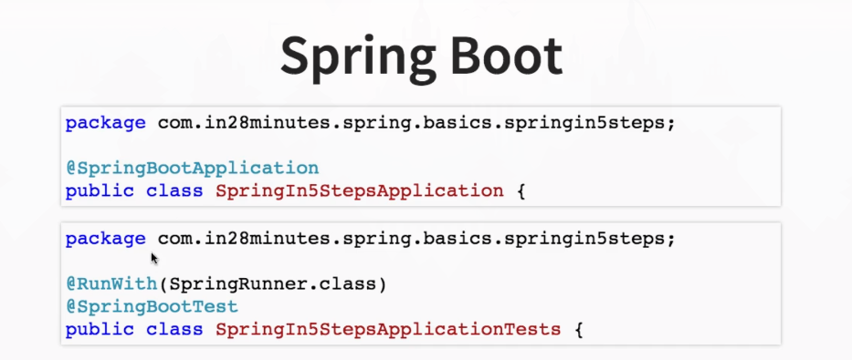

### 1.Loose Coupling vs Tight Coupling
**Tight Coupling**

Tight coupling refers to a situation where components in a system are highly dependent on each other. This means that a change in one component often necessitates changes in other components. Tight coupling can lead to systems that are hard to maintain, test, and extend because the interconnectedness means that altering one part of the system has wide-ranging effects.

**Example of Tight Coupling:**

Consider a class `A` that uses a class `B` directly:

```java
class B {
    public void doSomething() {
        System.out.println("Doing something in B");
    }\
}

class A {
    private B b = new B();

    public void execute() {
        b.doSomething();
    }
}
```

In this example, `A` is tightly coupled to `B`. If `B` changes (e.g., if the method `doSomething` is renamed or its parameters change), `A` also needs to be updated to accommodate these changes.

**Loose Coupling**

Loose coupling refers to a situation where components in a system have little or no knowledge of the definitions of other components. This makes the system more modular, easier to maintain, test, and extend because changes in one component are less likely to impact others.

**Example of Loose Coupling:**

Using interfaces or dependency injection can help achieve loose coupling. Here's how the above example can be refactored for loose coupling:

```java
interface Service {
    void doSomething();
}

class B implements Service {
    public void doSomething() {
        System.out.println("Doing something in B");
    }
}

class A {
    private Service service;

    public A(Service service) {
        this.service = service;
    }

    public void execute() {
        service.doSomething();
    }
}
```

In this example, `A` depends on an interface `Service` rather than a concrete class `B`. This way, `A` is not directly dependent on `B`. You can change the implementation of `B` or use a different implementation of `Service` without changing `A`:

```java
class AnotherService implements Service {
    public void doSomething() {
        System.out.println("Doing something in AnotherService");
    }
}

// Using the loosely coupled setup
Service service = new AnotherService();
A a = new A(service);
a.execute();  // Output: Doing something in AnotherService
```

**Benefits of Loose Coupling:**
- **Flexibility**: Components can be replaced or updated independently.
- **Maintainability**: Easier to understand, test, and modify.
- **Scalability**: New features or components can be added without significant refactoring.
- **Reusability**: Components can be reused in different contexts.

In summary, tight coupling creates a rigid system where components are heavily interdependent, whereas loose coupling promotes a more modular, flexible, and maintainable system.****
****

### 2.What is Dependency?

- A **dependency** in software engineering is a relationship where one component or module relies on another to function. 
- Dependencies can be between classes, functions, modules, services, or even entire applications. 
- Managing dependencies is crucial for building maintainable, scalable, and flexible software.

#### Example of Dependency

Consider two classes, `Car` and `Engine`. The `Car` class depends on the `Engine` class to function:

```java
public class Engine {
    public void start() {
        System.out.println("Engine started");
    }
}

public class Car {
    private Engine engine;

    public Car() {
        this.engine = new Engine(); // Car depends on Engine
    }

    public void drive() {
        engine.start();
        System.out.println("Car is driving");
    }
}

public class Main {
    public static void main(String[] args) {
        Car car = new Car();
        car.drive();
    }
}
```

In this example, `Car` is tightly coupled to `Engine`, meaning `Car` directly creates an instance of `Engine` and relies on it to function.

****
### 3.What is Dependency Injection?

- **Dependency Injection (DI)** is a design pattern used to achieve Inversion of Control (IoC) between classes and their dependencies. 
- Instead of a class creating its dependencies, they are provided externally. 
- This promotes loose coupling and makes the code more modular, testable, and maintainable.

#### Example of Dependency Injection

Using the same `Car` and `Engine` example, but applying dependency injection:

1. **Define the Engine Interface:**

```java
public interface Engine {
    void start();
}
```

2. **Implement the Engine Interface:**

```java
public class PetrolEngine implements Engine {
    @Override
    public void start() {
        System.out.println("Petrol engine started");
    }
}

public class DieselEngine implements Engine {
    @Override
    public void start() {
        System.out.println("Diesel engine started");
    }
}
```

3. **Modify the Car Class to Use Dependency Injection:**

```java
public class Car {
    private Engine engine;

    // Constructor Injection
    public Car(Engine engine) {
        this.engine = engine;
    }

    public void drive() {
        engine.start();
        System.out.println("Car is driving");
    }
}
```

4. **Inject Dependencies in the Main Method:**

```java
public class Main {
    public static void main(String[] args) {
        Engine petrolEngine = new PetrolEngine();
        Car carWithPetrolEngine = new Car(petrolEngine);
        carWithPetrolEngine.drive();

        Engine dieselEngine = new DieselEngine();
        Car carWithDieselEngine = new Car(dieselEngine);
        carWithDieselEngine.drive();
    }
}
```

### Benefits of Dependency Injection

1. **Loose Coupling:** By injecting dependencies, classes are less dependent on specific implementations, making the system more flexible.
2. **Testability:** Dependencies can be easily mocked or stubbed, making unit testing simpler and more effective.
3. **Maintainability:** Changes in dependencies require minimal changes in dependent classes.
4. **Reusability:** Components can be reused with different dependencies without modification.

### Types of Dependency Injection

1. **Constructor Injection:** Dependencies are provided through a class constructor.
    ```java
    public class Car {
        private Engine engine;

        public Car(Engine engine) {
            this.engine = engine;
        }
    }
    ```

2. **Setter Injection:** Dependencies are provided through setter methods.
    ```java
    public class Car {
        private Engine engine;

        public void setEngine(Engine engine) {
            this.engine = engine;
        }
    }
    ```

3. **Interface Injection:** Dependencies are provided through an interface. (Less common)
    ```java
    public interface Engine {
        void injectCar(Car car);
    }
    ```

### Conclusion

Dependency and Dependency Injection are core concepts in software design that promote modularity, flexibility, and testability. By externalizing the creation and management of dependencies, you can build more maintainable and adaptable software systems.
****

### Classes vs. Objects in Java

**Classes** and **objects** are fundamental concepts in object-oriented programming (OOP). Here’s a brief explanation along with examples to illustrate the difference between them.

### Classes

A **class** is a blueprint for creating objects. It defines the properties (attributes) and behaviors (methods) that the objects created from the class will have.

#### Example of a Class

```java
public class Car {
    // Properties (attributes)
    private String brand;
    private String model;
    private int year;

    // Constructor
    public Car(String brand, String model, int year) {
        this.brand = brand;
        this.model = model;
        this.year = year;
    }

    // Method (behavior)
    public void displayInfo() {
        System.out.println("Brand: " + brand + ", Model: " + model + ", Year: " + year);
    }
}
```

In this example:
- `Car` is a class with three properties: `brand`, `model`, and `year`.
- It has a constructor to initialize these properties.
- It has a method `displayInfo` to display the information of the car.

### Objects

An **object** is an instance of a class. It is a concrete entity based on the class blueprint and occupies memory.

#### Example of Objects

```java
public class Main {
    public static void main(String[] args) {
        // Creating objects from the Car class
        Car car1 = new Car("Toyota", "Corolla", 2020);
        Car car2 = new Car("Honda", "Civic", 2021);

        // Calling methods on the objects
        car1.displayInfo();
        car2.displayInfo();
    }
}
```

In this example:
- `car1` and `car2` are objects (instances) of the `Car` class.
- Each object has its own set of properties (`brand`, `model`, and `year`).
- The `displayInfo` method is called on each object to display its details.

### Key Differences

1. **Definition:**
   - **Class:** A template or blueprint for creating objects.
   - **Object:** An instance of a class.

2. **Memory Allocation:**
   - **Class:** Does not occupy memory until an object is created.
   - **Object:** Occupies memory when it is instantiated.

3. **Usage:**
   - **Class:** Defines the structure and behaviors that the objects will have.
   - **Object:** Represents individual instances that can have different states.

### Visual Representation

Consider a class as a blueprint for building a house:
- The **blueprint (class)** defines the structure, layout, and design of houses.
- **Houses (objects)** built from this blueprint can be different instances with unique colors, owners, and furniture but follow the same general design.

In summary:
- **Class:** Defines the properties and behaviors.
- **Object:** Is a specific instance of a class with actual values for the properties and capable of exhibiting the defined behaviors.
****

### 4.What is Inversion of Control (IOC)?
- Inversion of Control (IoC) is a design principle in software engineering where the control flow of a program is inverted. 
- Instead of the application controlling the flow, an external entity or framework takes over that control. 
- IoC is often used in conjunction with dependency injection to create more flexible, maintainable, and testable software.

### Key Concepts

1. **Traditional Control Flow:**
   - In a traditional setup, the application code directly controls the execution flow and manages dependencies. For example, creating objects, calling methods, etc.

2. **Inversion of Control:**
   - With IoC, the control is inverted. The framework or container takes over the responsibility of managing the flow of control and the lifecycle of objects. The application code provides configuration and business logic, while the framework handles the rest.

### How IoC Works

IoC can be implemented in various ways, such as using dependency injection, service locators, or event-driven programming. The most common approach is dependency injection.

### Dependency Injection and IoC

**Dependency Injection (DI)** is a technique used to achieve IoC by injecting dependencies into objects rather than the objects creating the dependencies themselves.

#### Example of IoC with Dependency Injection

Here's an example to illustrate IoC using dependency injection:

#### Without IoC

```java
public class Engine {
    public void start() {
        System.out.println("Engine started");
    }
}

public class Car {
    private Engine engine;

    public Car() {
        this.engine = new Engine(); // Car creates its own Engine
    }

    public void drive() {
        engine.start();
        System.out.println("Car is driving");
    }
}

public class Main {
    public static void main(String[] args) {
        Car car = new Car();
        car.drive();
    }
}
```

In this traditional setup, the `Car` class directly controls the creation of its `Engine` dependency.

#### With IoC (Dependency Injection)

```java
public interface Engine {
    void start();
}

public class PetrolEngine implements Engine {
    @Override
    public void start() {
        System.out.println("Petrol engine started");
    }
}

public class Car {
    private Engine engine;

    // Dependency is injected via constructor
    public Car(Engine engine) {
        this.engine = engine;
    }

    public void drive() {
        engine.start();
        System.out.println("Car is driving");
    }
}

public class Main {
    public static void main(String[] args) {
        Engine engine = new PetrolEngine(); // Engine dependency is created outside
        Car car = new Car(engine);          // Engine is injected into Car
        car.drive();
    }****
}
```

In this setup, the control of creating the `Engine` object is inverted. The `Car` class does not create its own `Engine` object but receives it from outside (injected through the constructor).

### Benefits of IoC

1. **Decoupling:**
   - Objects are less tightly coupled because they do not create their own dependencies. This makes the code more modular and flexible.

2. **Ease of Testing:**
   - Dependencies can be easily mocked or stubbed, facilitating unit testing.

3. **Reusability:**
   - Components can be reused more easily in different contexts because they are not tied to specific implementations of their dependencies.

4. **Maintainability:**
   - The application is easier to maintain and extend because changes to dependencies require minimal changes to the dependent classes.

### Summary

**Inversion of Control (IoC)** is a design principle that shifts the control of program execution and dependency management from the application code to an external framework or container. Dependency injection is a common method to achieve IoC, resulting in decoupled, testable, and maintainable code.

****
### 5.What is Bean in Spring?

In simple terms, a **bean** in the context of the Spring Framework is an object that is created, configured, and managed by the Spring container. Think of a bean as a component or building block of a Spring application that Spring takes care of for you.

### Key Points in Simple Terms:

1. **Object**: A bean is just a regular Java object.
2. **Managed by Spring**: Instead of you creating and managing this object directly in your code, Spring does it for you.
3. **Configuration**: You tell Spring how to create and configure this object either through XML files, Java annotations, or Java configuration classes.
4. **Dependency Injection**: Spring can inject dependencies into your beans, which means it can set up and connect the different parts of your application automatically.

### Simple Example:

Imagine you have a `Car` that needs an `Engine` to run. In Spring:

1. **Define the Beans**:
   - You tell Spring about the `Car` and `Engine` objects.

```java
public class Engine {
    public void start() {
        System.out.println("Engine started");
    }
}

public class Car {
    private Engine engine;

    public Car(Engine engine) {
        this.engine = engine;
    }

    public void drive() {
        engine.start();
        System.out.println("Car is driving");
    }
}
```

2. **Configuration with Annotations**:
   - Use `@Component` to tell Spring these are the objects it should manage.

```java
import org.springframework.stereotype.Component;

@Component
public class Engine {
    public void start() {
        System.out.println("Engine started");
    }
}

@Component
public class Car {
    private Engine engine;

    @Autowired
    public Car(Engine engine) {
        this.engine = engine;
    }

    public void drive() {
        engine.start();
        System.out.println("Car is driving");
    }
}
```

3. **Spring Takes Care of the Rest**:
   - You don’t have to create and wire up the `Car` and `Engine` objects manually. Spring does it for you.

```java
import org.springframework.context.ApplicationContext;
import org.springframework.context.annotation.AnnotationConfigApplicationContext;

public class Main {
    public static void main(String[] args) {
        ApplicationContext context = new AnnotationConfigApplicationContext(AppConfig.class);
        Car car = context.getBean(Car.class);
        car.drive();
    }
}
```

In this setup:
- Spring creates the `Engine` and `Car` objects.
- Spring injects the `Engine` into the `Car` automatically.

### Summary:

A **bean** is a Spring-managed object that Spring takes care of creating, configuring, and wiring together with other beans. This helps simplify your application code and manage dependencies more effectively.

****
### 6. What is Autowiring?

- **Autowiring** is a feature in Spring Framework that allows the automatic injection of dependencies into a bean, reducing the need for explicit configuration. 
- Autowiring can automatically resolve and inject collaborating beans into your Spring-managed bean.

### Autowired Annotation

The `@Autowired` annotation in Spring is used to enable automatic dependency injection. It can be applied to constructors, fields, setter methods, and configuration methods to indicate that the dependency should be autowired by the Spring container.

### Types of Autowiring in Spring

1. **no**: Default setting, autowiring is turned off. Dependencies need to be explicitly defined in the configuration.
2. **byName**: Autowires by property name. Spring looks for a bean with the same name as the property to inject.
3. **byType**: Autowires by type. Spring looks for a bean of the same type as the property to inject.
4. **constructor**: Autowires by type using the constructor. This is suitable for constructor-based dependency injection.
5. **autodetect**: Spring first tries constructor autowiring, and if no suitable constructor is found, it uses byType autowiring.

### Using @Autowired Annotation

#### Field Injection

```java
import org.springframework.beans.factory.annotation.Autowired;
import org.springframework.stereotype.Component;

@Component
public class Car {
    @Autowired
    private Engine engine;

    public void drive() {
        engine.start();
        System.out.println("Car is driving");
    }
}
```

#### Setter Injection

```java
import org.springframework.beans.factory.annotation.Autowired;
import org.springframework.stereotype.Component;

@Component
public class Car {
    private Engine engine;

    @Autowired
    public void setEngine(Engine engine) {
        this.engine = engine;
    }

    public void drive() {
        engine.start();
        System.out.println("Car is driving");
    }
}
```

#### Constructor Injection

```java
import org.springframework.beans.factory.annotation.Autowired;
import org.springframework.stereotype.Component;

@Component
public class Car {
    private final Engine engine;

    @Autowired
    public Car(Engine engine) {
        this.engine = engine;
    }

    public void drive() {
        engine.start();
        System.out.println("Car is driving");
    }
}
```

### Configuration for Autowiring

#### XML Configuration

```xml
<beans xmlns="http://www.springframework.org/schema/beans"
    xmlns:xsi="http://www.w3.org/2001/XMLSchema-instance"
    xsi:schemaLocation="http://www.springframework.org/schema/beans
    http://www.springframework.org/schema/beans/spring-beans.xsd">

    <context:component-scan base-package="com.example" />

</beans>
```

#### Java Configuration

```java
import org.springframework.context.annotation.ComponentScan;
import org.springframework.context.annotation.Configuration;

@Configuration
@ComponentScan(basePackages = "com.example")
public class AppConfig {
}
```

### Benefits of Autowiring

1. **Reduced Configuration**: Reduces the need for explicit bean wiring, making configuration simpler and cleaner.
2. **Increased Productivity**: Speeds up development by minimizing boilerplate code.
3. **Flexibility**: Supports various autowiring modes to fit different scenarios.

### Example of Autowiring

Let's combine all these concepts into a single example:

#### Engine Interface and Implementation

```java
public interface Engine {
    void start();
}

@Component
public class PetrolEngine implements Engine {
    @Override
    public void start() {
        System.out.println("Petrol engine started");
    }
}
```

#### Car Class Using @Autowired

```java
@Component
public class Car {
    private Engine engine;

    @Autowired
    public Car(Engine engine) {
        this.engine = engine;
    }

    public void drive() {
        engine.start();
        System.out.println("Car is driving");
    }
}
```

#### Spring Application Configuration

```java
import org.springframework.context.annotation.ComponentScan;
import org.springframework.context.annotation.Configuration;

@Configuration
@ComponentScan(basePackages = "com.example")
public class AppConfig {
}
```

#### Main Class to Run the Application

```java
import org.springframework.context.ApplicationContext;
import org.springframework.context.annotation.AnnotationConfigApplicationContext;

public class Main {
    public static void main(String[] args) {
        ApplicationContext context = new AnnotationConfigApplicationContext(AppConfig.class);
        Car car = context.getBean(Car.class);
        car.drive();
    }
}
```

In this complete example:
- `Engine` is an interface.
- `PetrolEngine` is a concrete implementation of `Engine` and is annotated with `@Component` to be detected by component scanning.
- `Car` has a dependency on `Engine` and uses constructor-based autowiring to inject the dependency.
- `AppConfig` is a configuration class that uses `@ComponentScan` to enable component scanning.
- The `Main` class runs the application and retrieves the `Car` bean from the Spring context to invoke the `drive` method.

Autowiring with `@Autowired` simplifies dependency injection and reduces the amount of configuration required in your Spring application.

****

### 7.What are the important roles of an IOC Container?
- Find beans :
    - Identifies the required beans (components) to be managed.
    - Creates instance of the beans.
    - Manages the lifecycle of the beans from creation to initialisation to destruction.
- Manage the lifecycle of beans
- Wire Dependency
    - Identifies the dependency required by the beans.
    - wires the dependency into the beans.

### Example Code

1. **Components and Beans**

```java
import org.springframework.beans.factory.annotation.Autowired;
import org.springframework.context.annotation.ComponentScan;
import org.springframework.context.annotation.Configuration;
import org.springframework.context.annotation.AnnotationConfigApplicationContext;
import org.springframework.stereotype.Component;
import javax.annotation.PostConstruct;
import javax.annotation.PreDestroy;

// Define the SortAlgorithm interface
interface SortAlgorithm {
    void sort();
}

// QuickSortAlgorithm implementation
@Component
class QuickSortAlgorithm implements SortAlgorithm {
    @Override
    public void sort() {
        System.out.println("QuickSort algorithm is sorting");
    }
}

// ComplexAlgorithm component with a dependency on SortAlgorithm
@Component
class ComplexAlgorithm {
    private final SortAlgorithm sortAlgorithm;

    @Autowired
    public ComplexAlgorithm(SortAlgorithm sortAlgorithm) {
        this.sortAlgorithm = sortAlgorithm;
    }

    public void performComplexOperation() {
        System.out.println("Performing complex algorithm operation");
        sortAlgorithm.sort();
    }

    @PostConstruct
    public void init() {
        System.out.println("ComplexAlgorithm bean is initialized");
    }

    @PreDestroy
    public void destroy() {
        System.out.println("ComplexAlgorithm bean is about to be destroyed");
    }
}

// Configuration class for component scanning
@Configuration
@ComponentScan(basePackages = "com.example")
class AppConfig {
}

// Main application class
public class MainApp {
    public static void main(String[] args) {
        AnnotationConfigApplicationContext context = new AnnotationConfigApplicationContext(AppConfig.class);
        ComplexAlgorithm complexAlgorithm = context.getBean(ComplexAlgorithm.class);
        complexAlgorithm.performComplexOperation();
        context.close();
    }
}
```

### Explanation

1. **Bean Creation and Management:**
   - **Identification of Beans:**
     - `@Component` on `QuickSortAlgorithm` and `ComplexAlgorithm` makes them Spring-managed beans.
   - **Bean Creation:**
     - Spring automatically creates instances of these beans.

2. **Dependency Injection:**
   - **Identification of Dependencies:**
     - `ComplexAlgorithm` requires a `SortAlgorithm`.
   - **Wiring Dependencies:**
     - `@Autowired` injects `QuickSortAlgorithm` into `ComplexAlgorithm`.

3. **Lifecycle Management:**
   - **Initialization:**
     - `@PostConstruct` annotated `init` method in `ComplexAlgorithm` is called after the bean is fully initialized.
   - **Destruction:**
     - `@PreDestroy` annotated `destroy` method in `ComplexAlgorithm` is called before the bean is destroyed.

### Running the Example
**Run the Main Application:**
   - Execute the `MainApp` class. You should see the following output:
     ```
     ComplexAlgorithm bean is initialized
     Performing complex algorithm operation
     QuickSort algorithm is sorting
     ComplexAlgorithm bean is about to be destroyed
     ```

This example demonstrates how the Spring IoC container identifies beans, manages dependencies, and handles bean lifecycle events.

****

### 8.What are Bean Factory and Application Context?
There are two parts of IOC Container -
#### 1. BeanFactory
- **Basic Container**: Provides fundamental IoC capabilities.
- **Roles**:
  - **Find Beans**:
    - Identifies the required beans (components) to be managed.
    - Creates instances of the beans.
    - Manages the lifecycle of the beans from creation to initialization to destruction.
  - **Wire Dependency**:
    - Identifies the dependencies required by the beans.
    - Wires the dependencies into the beans.
- **Use Cases**:
  - Suitable for lightweight applications that uses less memory.

#### 2. ApplicationContext (BeanFactory++)
- **Advanced Container**: Extends BeanFactory and provides additional enterprise-level features.
- **Additional Features**:
  - **AOP (Aspect-Oriented Programming)**:
    - Built-in support for defining and managing aspects.
  - **Internationalization (i18n)**:
    - Provides support for message sources for localization.
  - **Web Application Context**:
    - Specific features for web applications, such as request and session scopes.
- **Use Cases**:
- Suitable for: Enterprise-level and complex applications.

****
### 9.How do you create an application context with Spring?
Creating an application context with Spring involves setting up your Spring application configuration and using one of the available classes to initialize the context. Here's a step-by-step guide on how to do this:

### 1. Using XML Configuration

#### Step 1: Create the XML Configuration File

Create an XML file (e.g., `applicationContext.xml`) to define your beans and their dependencies.

```xml
<!-- applicationContext.xml -->
<beans xmlns="http://www.springframework.org/schema/beans"
       xmlns:xsi="http://www.w3.org/2001/XMLSchema-instance"
       xsi:schemaLocation="http://www.springframework.org/schema/beans
                           http://www.springframework.org/schema/beans/spring-beans.xsd">

    <!-- Define a bean -->
    <bean id="simpleBean" class="com.example.SimpleBean"/>
    
</beans>
```

#### Step 2: Create the Java Classes

Define your beans in Java classes.

```java
package com.example;

public class SimpleBean {
    public void sayHello() {
        System.out.println("Hello from SimpleBean");
    }
}
```

#### Step 3: Load the ApplicationContext in the Main Class

Use `ClassPathXmlApplicationContext` to load the context from the XML configuration.

```java
import org.springframework.context.ApplicationContext;
import org.springframework.context.support.ClassPathXmlApplicationContext;

public class MainApp {
    public static void main(String[] args) {
        ApplicationContext context = new ClassPathXmlApplicationContext("applicationContext.xml");
        SimpleBean simpleBean = (SimpleBean) context.getBean("simpleBean");
        simpleBean.sayHello();
    }
}
```

### 2. Using Java Configuration

#### Step 1: Create the Configuration Class

Define a configuration class using `@Configuration` and `@Bean` annotations.

```java
import org.springframework.context.annotation.Bean;
import org.springframework.context.annotation.Configuration;

@Configuration
public class AppConfig {

    @Bean
    public SimpleBean simpleBean() {
        return new SimpleBean();
    }
}
```

#### Step 2: Create the Java Classes

Define your beans in Java classes.

```java
package com.example;

public class SimpleBean {
    public void sayHello() {
        System.out.println("Hello from SimpleBean");
    }
}
```

#### Step 3: Load the ApplicationContext in the Main Class

Use `AnnotationConfigApplicationContext` to load the context from the Java configuration class.

```java
import org.springframework.context.ApplicationContext;
import org.springframework.context.annotation.AnnotationConfigApplicationContext;

public class MainApp {
    public static void main(String[] args) {
        ApplicationContext context = new AnnotationConfigApplicationContext(AppConfig.class);
        SimpleBean simpleBean = context.getBean(SimpleBean.class);
        simpleBean.sayHello();
    }
}
```


### Summary

- **XML Configuration**: Use `ClassPathXmlApplicationContext` to load the context from an XML configuration file.
- **Java Configuration**: Use `AnnotationConfigApplicationContext` to load the context from a Java configuration class.
- **Spring Boot**: Automatically creates and configures the application context.

Each approach has its use cases, with XML and Java configurations being more explicit, while Spring Boot provides a more streamlined and automated setup.

****
### 10. How does Spring know where to search for Components or Beans?
Actually spring doesnt know where to search for the component, we need to tell the spring, like this is the pkg you need to look there for the component.

### 11. What is a Component Scan?
The process of scanning the components is Component Scan.

There are 2 ways to define our component scan.


### 12. How do you define a component scan in XML and Java Configurations?

### 13. How is it done with Spring Boot?

@SpringBootApplication automatically enables component scanning.

it enables automatic scanning for the pkg, in class @SpringBootApplication is used.

### How does Spring know where to search for Components or Beans?

Spring knows where to search for components or beans through a mechanism called **component scanning**. By specifying the packages to scan, Spring automatically detects classes annotated with stereotype annotations (like `@Component`, `@Service`, `@Repository`, `@Controller`, etc.) and registers them as beans in the application context.

### What is a Component Scan?

A **component scan** is a process by which Spring automatically discovers and registers beans with the Spring container. During component scanning, Spring searches the specified base packages for classes annotated with Spring's stereotype annotations and registers them as beans.

### How to Define a Component Scan

#### In XML Configuration

You define a component scan in an XML configuration file using the `<context:component-scan>` element. You specify the base package(s) to scan for components.

**Example**:
```xml
<!-- applicationContext.xml -->
<beans xmlns="http://www.springframework.org/schema/beans"
       xmlns:xsi="http://www.w3.org/2001/XMLSchema-instance"
       xmlns:context="http://www.springframework.org/schema/context"
       xsi:schemaLocation="http://www.springframework.org/schema/beans
                           http://www.springframework.org/schema/beans/spring-beans.xsd
                           http://www.springframework.org/schema/context
                           http://www.springframework.org/schema/context/spring-context.xsd">

    <!-- Define component scan -->
    <context:component-scan base-package="com.example"/>
    
</beans>
```

#### In Java Configuration

You define a component scan in a Java configuration class using the `@ComponentScan` annotation. You specify the base package(s) to scan as a parameter to the annotation.

**Example**:
```java
import org.springframework.context.annotation.ComponentScan;
import org.springframework.context.annotation.Configuration;

@Configuration
@ComponentScan(basePackages = "com.example")
public class AppConfig {
}
```

#### In Spring Boot

Spring Boot simplifies the configuration by using the `@SpringBootApplication` annotation, which includes `@ComponentScan` by default. By placing your main application class in the root package, Spring Boot will automatically scan the current package and all sub-packages for components.

**Example**:
```java
import org.springframework.boot.SpringApplication;
import org.springframework.boot.autoconfigure.SpringBootApplication;

@SpringBootApplication
public class SpringBootApp {
    public static void main(String[] args) {
        SpringApplication.run(SpringBootApp.class, args);
    }
}
```

By default, `@SpringBootApplication` triggers component scanning in the package of the class it's annotated on and its sub-packages. If you need to customize the packages to scan, you can still use `@ComponentScan` along with `@SpringBootApplication`.

**Customized Example**:
```java
import org.springframework.boot.SpringApplication;
import org.springframework.boot.autoconfigure.SpringBootApplication;
import org.springframework.context.annotation.ComponentScan;

@SpringBootApplication
@ComponentScan(basePackages = "com.example")
public class SpringBootApp {
    public static void main(String[] args) {
        SpringApplication.run(SpringBootApp.class, args);
    }
}
```

### Summary:

- **How does Spring know where to search for Components or Beans?**
  - Through **component scanning**, which automatically detects and registers beans.

- **What is a Component Scan?**
  - A process that searches specified packages for classes annotated with stereotype annotations and registers them as beans.

- **How to Define a Component Scan:**
  - **XML Configuration**: Use `<context:component-scan>` in `applicationContext.xml`.
  - **Java Configuration**: Use `@ComponentScan` annotation in a configuration class.
  - **Spring Boot**: Use `@SpringBootApplication` which includes component scanning by default. Optionally, customize with `@ComponentScan`.